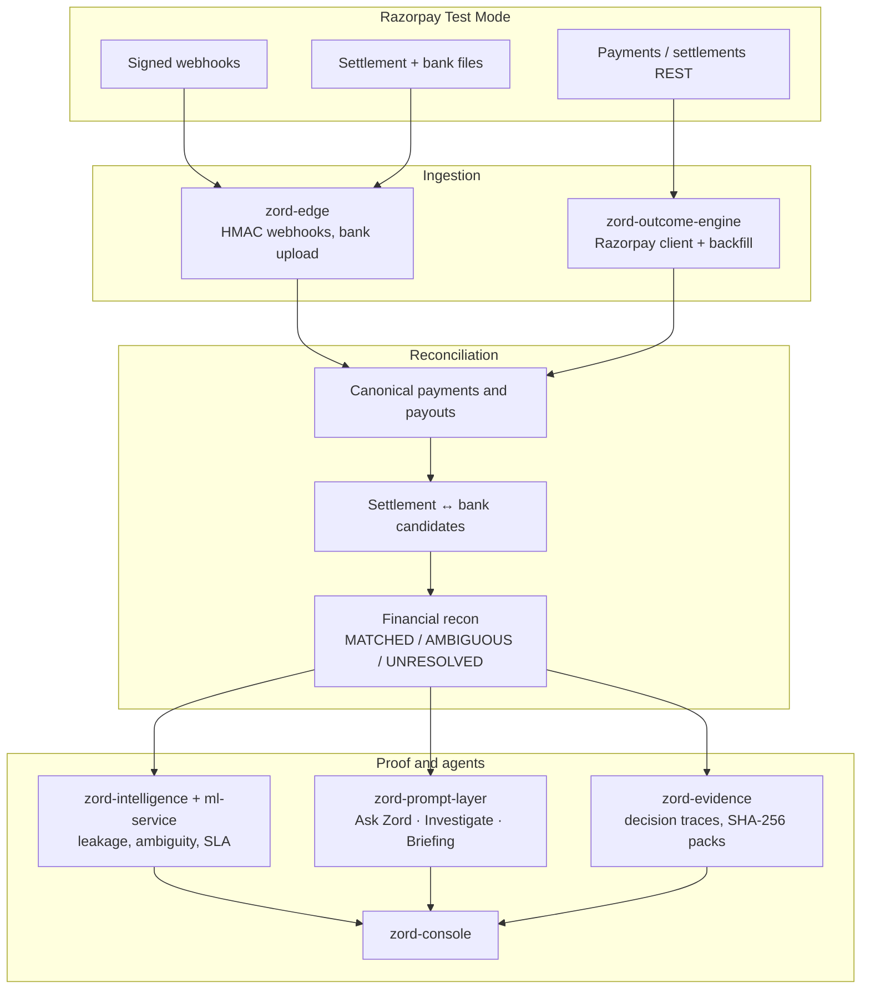

<div align="center">


# Razorpay Reconciliation

**Match Razorpay settlements to bank cash. Prove the exceptions.**

Ingest events and files · reconcile a batch · cite evidence

Razorpay `settled` is never `bank_credited`

<br/>

[](https://go.dev)
[](https://nextjs.org)
[](https://www.python.org)
[](https://www.postgresql.org)
[](https://razorpay.com)
[](./LICENSE)

</div>

---

## Problem

Banks, Razorpay, and internal ledgers each hold a different version of the same payment. Finance teams reconcile that gap in spreadsheets. Matches get forced. Settled is treated as cash received. Exceptions have no evidence trail.

This project closes one loop on a batch of records:

1. Ingest Razorpay payments, settlements, and bank statements
2. Reconcile with confidence — never coerce `AMBIGUOUS` into `MATCHED`
3. Report match rate and the exceptions that could not be resolved
4. Let an agent explain or investigate using tools, not invented amounts

---

## How reconciliation works

| Source | What it is | What it is not |
|---|---|---|
| Razorpay payment (`authorized` / `captured` / `failed`) | Provider lifecycle | Bank cash |
| Razorpay `settled` | PSP marked the payment settled | Money in the merchant account |
| Settlement file / recon API | Line-level fees, tax, net | Bank CREDIT |
| Bank statement CREDIT / DEBIT | Observed cash movement | Razorpay status rename |

`MATCHED` means the books are accounted for. It is not `fully_reconciled` and not `bank_credited`. Failed payments with no settlement and no bank movement are `MATCHED` (nothing moved). Unexplained bank CREDIT/DEBIT is `UNRESOLVED` plus an exception.

---

## System Architecture

Razorpay is a first-class source, not a sidecar. Webhooks and the Payments API land as observations. Outcome-engine reduces them to canonical payments, matches settlement lines to bank rows, then runs payment-first financial recon. Intelligence projects the batch. Agents read those APIs — they do not re-score UTR or rename Razorpay status.



**Data path**

1. **Connect** — Razorpay Test Mode key, HMAC webhook, optional payments API backfill
2. **Observe** — immutable `provider.observation.received` events; Razorpay status stored as `provider_status`
3. **Canonicalize** — one current `canonical_payments` row; status never walks backwards (`captured` is not overwritten by a late `authorized`)
4. **Match settlement to bank** — candidates only (`EXACT_MATCH` … `ORPHAN_BANK`); this step does not mark cash received
5. **Reconcile** — `POST /v1/reconciliation/run` on payments and payouts; exceptions stay honest
6. **Explain** — Ask Zord copies numbers from APIs; the investigation agent walks exceptions with a tool budget

---

## Intelligence and agents

Deterministic recon owns the numbers. The model only writes prose.

| Capability | Where | Role |
|---|---|---|
| Leakage, ambiguity, defensibility, RCA, pattern, SLA | `zord-intelligence` + `ml-service` | Project the batch; CatBoost / z-score / HDBSCAN never invent a match |
| Ask Zord | `agents/askzord` | Finance Q&A with citations. Rejects numeric and status hallucinations |
| Investigation agent | `agents/investigate` | Hypothesis loop on exceptions. Cannot force `MATCHED` or assign `PROVEN` |
| Finance investigator | `agents/finance` | Walk one payment or payout through recon + evidence tools |
| Close briefing | `agents/briefing` | Rewrite match rate, exceptions, and exposure without adding figures |

Hard rules: `settled` ≠ `bank_credited`. `UNKNOWN` is first-class. `AMBIGUOUS` is never coerced.

Console: `/ask` and `/investigations`.

---

## Key Features

- Razorpay Test/Live client, signed webhooks, and payments API backfill
- Canonical payment and payout truth that preserves native Razorpay status names
- Settlement and bank file ingest with duplicate-file detection
- Payment-first recon with match rate, exception list, and evaluation on 100+ labeled records
- Evidence packs with decision / calculation traces
- Ask Zord and investigation agents over HTTP tools (no second matcher)
- Multi-tenant isolation, DLQ, and PII tokenization

---

## Repository Structure

```
razorpay-reconciliation/
├── backend/
│   ├── zord-edge/               # Webhooks, bank upload, connectors
│   ├── zord-intent-engine/      # Canonical intents
│   ├── zord-relay/              # Event dispatch
│   ├── zord-outcome-engine/     # Razorpay client, canonical payments, recon
│   ├── zord-evidence/           # Finance evidence packs
│   ├── zord-intelligence/       # Batch projections
│   ├── zord-prompt-layer/       # Ask Zord, investigate, briefing
│   ├── zord-token-enclave/      # PII boundary
│   ├── zord-console/            # Next.js console
│   ├── ml-service/              # Leakage / anomaly inference
│   └── zord-airflow/            # Backfill scheduling
├── testdata/razorpay/           # Settlement and bank fixtures
├── docs/                        # Implementation notes
├── functional-tests/
└── performance-tests/
```

---

## Tech Stack

| Layer | Technology |
|---|---|
| Language | Go 1.24, TypeScript, Python 3.11 |
| APIs | Gin, Next.js 14, FastAPI |
| Data | PostgreSQL 16, Kafka, Redis |
| Razorpay | Test Mode REST + webhook HMAC |
| Agents | Go HTTP tools; Gemini for wording only |
| ML | scikit-learn, CatBoost, HDBSCAN |

---

## Getting Started

### Prerequisites

Docker Desktop, Go 1.24, Node.js 18+, npm 9+.

```bash
git clone https://github.com/swaroopt14/razorpay-reconciliation.git
cd razorpay-reconciliation
```

### Console

```bash
cd backend/zord-console
npm install
npm run dev
```

Open http://localhost:3000

### Razorpay engine tests

```bash
cd backend/zord-outcome-engine
go test ./internal/poll/providers/razorpay/ ./internal/paymenttruth/ \
  ./internal/poll/ ./internal/observe/ ./internal/recon/ ./handlers/ -count=1

cd backend/zord-edge
go test ./validator ./services ./handler -count=1

cd backend/zord-prompt-layer
go test ./agents/askzord/ ./agents/investigate/ ./agents/finance/ ./tools/ -count=1
```

### Evaluation harness

```bash
cd backend/zord-outcome-engine
go test ./internal/recon/eval/ -count=1
go run ./cmd/phase11-eval
```

Reports precision, recall, F1, match rate, false-match rate, and exception capture on 100+ labeled payment / payout / orphan records.

---

## Configuration

Copy `.env.example` to `.env` in each service directory you run.

| Variable | Description |
|---|---|
| `RAZORPAY_ENABLED` | Enable the connector (`true` / `false`) |
| `RAZORPAY_MODE` | `test` or `live` |
| `RAZORPAY_API_BASE_URL` | Razorpay API base URL |
| `RAZORPAY_KEY_ID` / `RAZORPAY_KEY_SECRET` | Test Mode credentials (gitignored) |
| `JWT_SIGNING_SECRET` | Console / API JWT |
| `DB_HOST` `DB_PORT` `DB_USER` `DB_PASSWORD` `DB_NAME` | PostgreSQL |

Live keys are refused unless explicitly allowed. Webhook signatures are verified over the raw body; invalid HMAC stores nothing.

---

## Core APIs

**Connect and ingest**

| Method | Endpoint |
|---|---|
| `POST` | `/v1/connectors/razorpay` |
| `GET` | `/v1/connectors/razorpay/status` |
| `POST` | `/v1/webhooks/razorpay/:connectorID` |
| `POST` | `/v1/bank-statements` |
| `POST` | `/v1/settlement/upload` |

**Reconcile**

| Method | Endpoint |
|---|---|
| `POST` | `/v1/reconciliation/run` |
| `GET` | `/v1/reconciliation/summary` |
| `GET` | `/v1/reconciliation/exceptions` |
| `GET` | `/v1/reconciliation/payments/:payment_id` |
| `GET` | `/v1/reconciliation/payouts/:payout_id` |

**Agents**

| Method | Endpoint |
|---|---|
| `POST` | `/v1/ask-zord/finance/query` |
| `POST` | `/v1/investigations` |
| `GET` | `/v1/investigations/:id` |
| `GET` | `/v1/investigations/:id/trace` |

```bash
curl -X POST http://localhost:8086/v1/ask-zord/finance/query \
  -H "Content-Type: application/json" \
  -d '{"tenant_id":"<uuid>","query":"What is the match rate and which exceptions remain?"}'
```

---

## Security

| Layer | Implementation |
|---|---|
| Auth | JWT, per-tenant API keys |
| Razorpay | Basic Auth, HMAC webhooks, redacted logs |
| PII | Token enclave, format-preserving encryption |
| Integrity | SHA-256 evidence snapshots |
| Audit | Immutable observation log and action contracts |

See [SECURITY.md](./SECURITY.md).

---

## License

MIT. See [LICENSE](./LICENSE).

Implementation notes: [docs/](./docs/).

---

## Contact

- **GitHub**: [swaroopt14](https://github.com/swaroopt14)
- **LinkedIn**: [Swaroop Thakare](https://www.linkedin.com/in/swaroop-thakare-136484259/)
