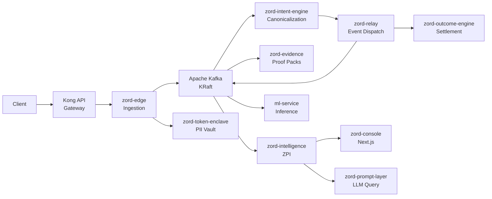
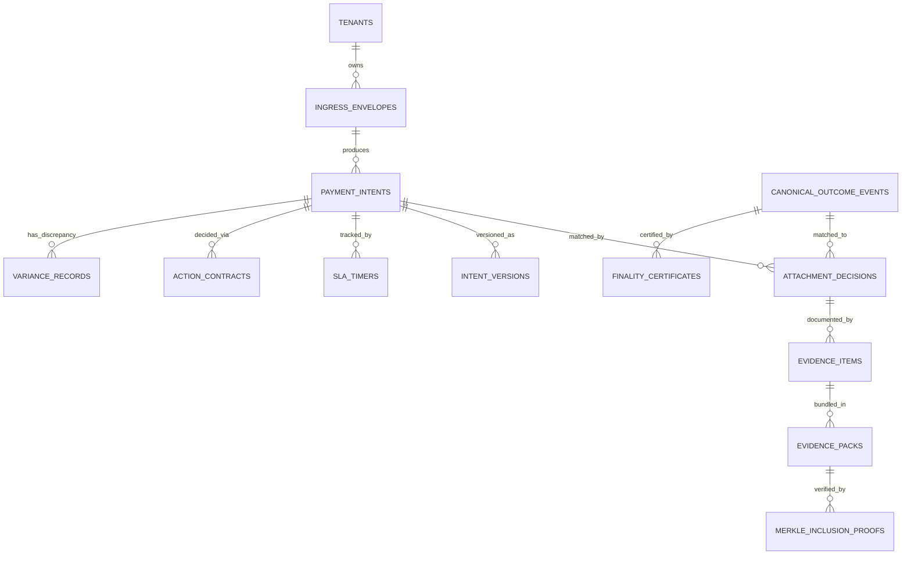
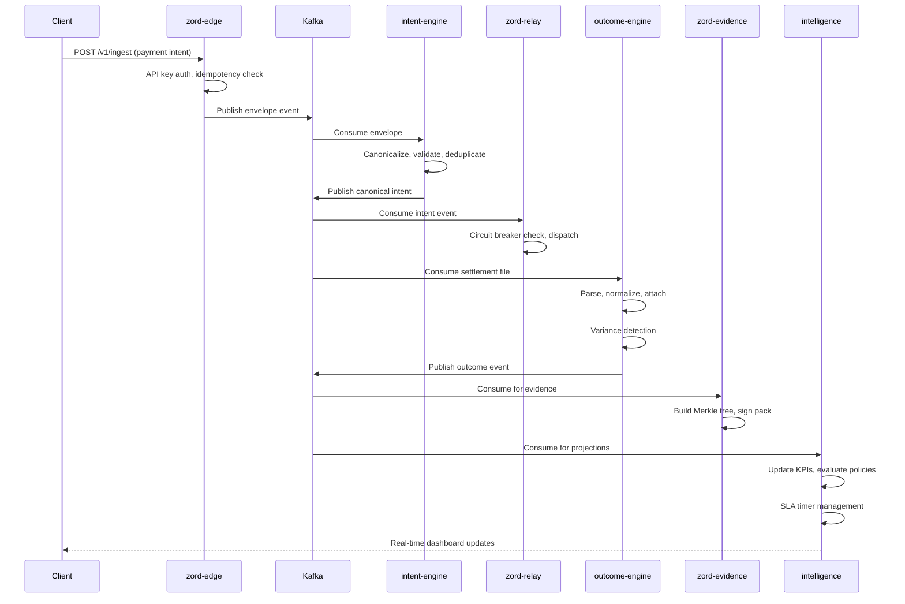

# Arealis Zord

A verifiable payment lifecycle platform. Ingestion, canonicalization, settlement reconciliation, evidence packaging, and predictive intelligence — orchestrated as independent services.

---

<!--  -->

<div align="center">


</div>

---

## Table of Contents

- [Problem](#problem)
- [Why Existing Systems Fail](#why-existing-systems-fail)
- [Solution](#solution)
- [Key Features](#key-features)
- [System Architecture](#system-architecture)
- [Repository Structure](#repository-structure)
- [Tech Stack](#tech-stack)
- [Getting Started](#getting-started)
- [Configuration](#configuration)
- [API Documentation](#api-documentation)
- [Database Design](#database-design)
- [Workflow](#workflow)
- [Screenshots](#screenshots)
- [Performance](#performance)
- [Security](#security)
- [Deployment](#deployment)
- [CI/CD](#cicd)
- [Testing](#testing)
- [Monitoring](#monitoring)
- [Roadmap](#roadmap)
- [Contributing](#contributing)
- [License](#license)
- [Acknowledgements](#acknowledgements)
- [Contact](#contact)

---

## Problem

Payment operations generate massive volumes of data across disconnected systems. Banks hold one version of truth. PSPs hold another. Settlement files tell a third story. Finance teams spend hours reconciling what actually happened — and they still can't prove it.

The core issue isn't that payments fail. It's that **payment truth becomes fragmented** the moment money moves across institutional boundaries. Every handoff — gateway to PSP, PSP to bank, bank to ledger — creates a seam where information is lost, delayed, or contradicted.

This fragmentation leads to:

- **Revenue leakage** that goes undetected for months
- **Ambiguous settlements** that no one can definitively match
- **Manual reconciliation** consuming thousands of hours per quarter
- **Dispute resolution** without a verifiable evidence trail
- **Compliance gaps** when audit trails are incomplete or inconsistent

---

## Why Existing Systems Fail

| Dimension | Current Process | Zord |
|---|---|---|
| **Reconciliation** | Manual spreadsheet matching across bank files, PSP exports, and internal ledgers | Automated attachment engine with confidence scoring and variance detection |
| **Evidence** | Scattered screenshots, email threads, and PDF exports assembled reactively | Cryptographically signed evidence packs with Merkle-tree integrity proofs |
| **Observability** | Siloed dashboards per system with no cross-system correlation | Unified projection engine with 7 intelligence families and real-time SLA tracking |
| **Dispute Handling** | Weeks of back-and-forth to compile supporting documentation | One-click dispute export with verifiable lineage and selective disclosure |
| **Audit Trail** | Partial logs across services, often incomplete after 90 days | Immutable intent versioning, action contracts, and finality certificates |
| **Leakage Detection** | Manual variance reports reviewed monthly | ML-powered leakage prediction with CatBoost regression and anomaly detection |

---

## Solution

Zord creates a **verifiable lifecycle** around payment events. Every intent is canonicalized, every outcome is correlated, every discrepancy is surfaced, and every decision is documented as an immutable action contract.

The platform operates on a simple principle: **payment truth should be provable, not assumed.**

Instead of asking finance teams to trust a single system's view, Zord constructs an independent, auditable record that spans ingestion, processing, settlement, and evidence — regardless of how many systems touch the money.

---

## Key Features

- **Payment Lifecycle Tracking** — End-to-end visibility from ingestion through settlement with immutable event lineage
- **Canonical Intent Engine** — Normalizes heterogeneous payment formats into a single, queryable schema
- **Automated Reconciliation** — Attachment engine matches intents to settlements with confidence scoring and variance analysis
- **Evidence Packaging** — Merkle-tree signed evidence packs with cryptographic verification and selective disclosure
- **Predictive Intelligence** — ML-powered leakage prediction, ambiguity detection, and SLA breach forecasting
- **Policy Engine** — DSL-based IF-THEN rules with 20+ seeded policies and immutable action contracts
- **Multi-Tenant Isolation** — Per-tenant databases, API keys, and connector configurations
- **Dead Letter Queue Management** — Structured DLQ with replay, retry, and investigation workflows
- **PII Tokenization** — Format-preserving encryption boundary for GDPR/PCI DSS compliance
- **Real-Time Dashboards** — Operator, customer, and admin views with role-based access control

---

## System Architecture



---

## Repository Structure

```
Arealis-Zord/
├── backend/
│   ├── zord-edge/                  # Ingestion gateway (Go, port 8080)
│   ├── zord-intent-engine/         # Canonicalization engine (Go, port 8083)
│   ├── zord-relay/                 # Event relay and dispatch (Go, port 8082)
│   ├── zord-outcome-engine/        # Settlement processing (Go, port 8081)
│   ├── zord-evidence/              # Evidence pack generation (Go)
│   ├── zord-intelligence/          # ZPI — projections, policies, SLA (Go)
│   ├── zord-prompt-layer/          # LLM-assisted query (Go)
│   ├── zord-token-enclave/         # PII tokenization boundary (Go)
│   ├── zord-console/               # Next.js 14 full-stack UI (port 3000)
│   ├── ml-service/                 # ML inference via Kafka (Python/FastAPI)
│   ├── zord-airflow/               # Apache Airflow DAGs (Python)
│   ├── payout-smoke-simulator/     # Payout testing tool (Node.js)
│   └── generated/                  # Pre-trained ML model artifacts
├── kubernetes/
│   ├── api-gateway/                # Kong API Gateway manifests
│   ├── eks/                        # Core EKS Kustomize manifests
│   ├── argocd/                     # Argo CD GitOps
│   ├── monitoring/                 # Prometheus + Grafana
│   ├── logging/                    # EFK stack
│   └── tracing/                    # OpenTelemetry + Jaeger
├── jenkins/                        # CI/CD pipeline assets
├── functional-tests/               # End-to-end functional tests
├── performance-tests/              # Load and performance testing
├── docs/                           # Architecture and design docs
├── CONTRIBUTING.md
├── SECURITY.md
└── LICENSE
```

---

## Tech Stack

| Layer | Technology |
|---|---|
| **Language** | Go 1.24, TypeScript (strict), Python 3.11 |
| **Web Framework** | Gin (Go), Next.js 14 App Router (React), FastAPI (Python) |
| **Database** | PostgreSQL 16 (7 per-service databases) |
| **Message Queue** | Apache Kafka (KRaft mode, no ZooKeeper) |
| **Cache** | Redis |
| **Object Storage** | AWS S3 (encrypted) |
| **Frontend** | TailwindCSS, Framer Motion, Three.js, Recharts |
| **AI/ML** | scikit-learn, CatBoost, HDBSCAN, Gemini API |
| **Observability** | OpenTelemetry, Prometheus, Grafana, Jaeger |
| **Orchestration** | Kubernetes (AWS EKS), Docker Compose |
| **API Gateway** | Kong (DB-less, declarative YAML) |
| **CI/CD** | Jenkins, Argo CD, SonarQube |
| **Secrets** | AWS Secrets Manager, External Secrets Operator |
| **Auth** | JWT (HS256), API keys, ed25519 signing |
| **Compliance** | Format-preserving encryption, GDPR/PCI DSS tokenization |

---

## Getting Started

### Prerequisites

| Requirement | Version |
|---|---|
| Docker Desktop | Latest |
| Docker Compose | v2+ |
| Go | 1.24.x |
| Node.js | 18+ |
| npm | 9+ |

### Installation

```bash
git clone https://github.com/swaroopt14/swaroopt14.git
cd Arealis-Zord
```

### Start the full stack

```bash
docker-compose up -d --build
```

Services available:

| Service | URL |
|---|---|
| Console | http://localhost:3000 |
| Edge API | http://localhost:8080 |
| Intent Engine | http://localhost:8083 |
| Outcome Engine | http://localhost:8081 |
| Kafka | localhost:9092 |
| PostgreSQL | localhost:5432 |
| Redis | localhost:6379 |

### Run a single Go service

```bash
cd backend/zord-edge
go mod download
go run ./cmd/main.go
```

### Run the console locally

```bash
cd backend/zord-console
npm install
npm run dev
```

---

## Configuration

Each service reads configuration from environment variables. Copy `.env.example` to `.env` in each service directory.

### Core Variables

| Variable | Required | Description |
|---|---|---|
| `JWT_SIGNING_SECRET` | Yes | JWT signing key (change in production) |
| `ZORD_VAULT_KEY` | Yes | Base64-encoded vault encryption key |
| `S3_BUCKET` | Yes | AWS S3 bucket for file storage |
| `AWS_REGION` | Yes | AWS region (default: `ap-south-1`) |
| `DB_HOST` | Yes | PostgreSQL host |
| `DB_PORT` | Yes | PostgreSQL port (default: `5433` for local) |
| `DB_USER` | Yes | Database user |
| `DB_PASSWORD` | Yes | Database password |
| `DB_NAME` | Yes | Database name (service-specific) |
| `DB_SSLMODE` | Yes | SSL mode (`disable` for local) |
| `AWS_ACCESS_KEY_ID` | No | AWS credentials for SES (email) |
| `AWS_SECRET_ACCESS_KEY` | No | AWS credentials for SES |
| `SES_FROM_EMAIL` | No | Sender email for MFA OTPs |
| `INTERNAL_ADMIN_KEY` | No | Internal admin API key |
| `SIGNING_KEY_PATH` | No | Path to ed25519 private key |

### Console Variables

| Variable | Description |
|---|---|
| `ZORD_EDGE_URL` | Edge API base URL |
| `ZORD_INTENT_ENGINE_URL` | Intent engine base URL |
| `ZORD_SETTLEMENT_URL` | Outcome engine base URL |
| `ZORD_INTELLIGENCE_URL` | Intelligence service URL |
| `ZORD_EVIDENCE_URL` | Evidence service URL |
| `PROMPT_LAYER_URL` | Prompt layer service URL |
| `NEXT_PUBLIC_ZORD_TENANT_ID` | Default tenant ID for UI |
| `ZORD_SETTLEMENT_API_KEY` | API key for settlement operations |
| `AUTH_COOKIE_SECURE` | Set `true` in production |

---

## API Documentation

### zord-edge — Ingestion Gateway

| Method | Endpoint | Description |
|---|---|---|
| `GET` | `/health` | Health check |
| `GET` | `/metrics` | Prometheus metrics |
| `POST` | `/v1/admin/tenantReg` | Register new tenant |
| `GET` | `/v1/admin/tenants` | List all tenants |
| `POST` | `/v1/ingest` | JSON intent ingestion |
| `POST` | `/v1/bulk-ingest` | Multipart bulk file ingestion |
| `POST` | `/v1/raw/envelopes/webhooks/:provider/:connectorID` | Webhook intake |

#### Ingest a payment intent

```bash
curl -X POST http://localhost:8080/v1/ingest \
  -H "Content-Type: application/json" \
  -H "X-API-Key: your-api-key" \
  -H "X-Idempotency-Key: unique-request-id" \
  -d '{
    "amount": 1500.00,
    "currency": "USD",
    "beneficiary_name": "Acme Corp",
    "beneficiary_account": "1234567890",
    "reference": "INV-2025-0042",
    "originator": "client-xyz"
  }'
```

```json
{
  "status": "accepted",
  "envelope_id": "env_8f3a2b1c",
  "intent_id": "int_4d5e6f7a",
  "processing_stage": "canonicalization"
}
```

### zord-outcome-engine — Settlement Processing

| Method | Endpoint | Description |
|---|---|---|
| `GET` | `/v1/health` | Health check |
| `POST` | `/v1/settlement/upload` | Upload settlement file |
| `GET` | `/v1/settlement/jobs/:job_id` | Check job status |
| `POST` | `/v1/attachment/run` | Trigger attachment job |
| `GET` | `/v1/attachment/decision/intent/:intent_id` | Get attachment decision |

#### Upload a settlement file

```bash
curl -X POST http://localhost:8081/v1/settlement/upload \
  -F "file=@settlement_march_2025.csv" \
  -F "provider=stripe"
```

### zord-evidence — Evidence Packaging

| Method | Endpoint | Description |
|---|---|---|
| `POST` | `/v1/evidence/packs` | Generate evidence pack |
| `GET` | `/v1/evidence/packs` | List evidence packs |
| `GET` | `/v1/evidence/packs/:packID` | Get enriched pack |
| `GET` | `/v1/evidence/packs/:packID/timeline` | Operational timeline |
| `POST` | `/v1/evidence/packs/:packID/verify` | Cryptographic verification |
| `POST` | `/v1/dispute/export` | Dispute export |

#### Generate an evidence pack

```bash
curl -X POST http://localhost:8084/v1/evidence/packs \
  -H "Content-Type: application/json" \
  -d '{
    "intent_id": "int_4d5e6f7a",
    "include_timeline": true,
    "include_lineage": true
  }'
```

### zord-intelligence — ZPI

| Method | Endpoint | Description |
|---|---|---|
| `GET` | `/v1/health` | Health check |
| `GET` | `/v1/projection` | Current projection state |
| `GET` | `/v1/policies` | List active policies |
| `GET` | `/v1/batch/:batchID` | Batch intelligence snapshot |

### zord-prompt-layer — LLM Query

| Method | Endpoint | Description |
|---|---|---|
| `GET` | `/health` | Health check |
| `POST` | `/query` | LLM-assisted query |

```bash
curl -X POST http://localhost:8086/query \
  -H "Content-Type: application/json" \
  -d '{
    "tenant_id": "00000000-0000-0000-0000-000000000001",
    "query": "Show me all unresolved intents from the last 7 days"
  }'
```

---

## Database Design

Zord uses per-service PostgreSQL databases. Each service owns its schema and migrations.

### Core Relationships



### Key Tables

**zord-edge**
- `tenants` — Tenant registry with API key hashes
- `ingress_envelopes` — Raw ingestion envelopes with metadata
- `ingress_outbox` — Transactional outbox for Kafka publishing

**zord-intent-engine**
- `payment_intents` — Canonical payment intents with scores and governance
- `intent_versions` — Immutable version chain for mutations
- `dlq_items` — Dead-letter queue for failed processing

**zord-outcome-engine**
- `canonical_settlement_observations` — Normalized settlement data
- `attachment_decisions` — Authoritative intent-to-settlement matching
- `variance_records` — Detected discrepancies
- `finality_certificates` — Cryptographic settlement proofs

**zord-evidence**
- `evidence_packs` — Merkle-rooted evidence bundles
- `merkle_inclusion_proofs` — Selective disclosure proofs

**zord-intelligence**
- `projection_state` — Computed KPIs across 7 intelligence families
- `policy_registry` — DSL-based IF-THEN rules
- `action_contracts` — Immutable signed audit trail
- `ml_feature_store` — Engineered features for ML scoring

---

## Workflow



---

## Screenshots

<!-- Update these paths to match your actual screenshots -->

| Dashboard | View |
|---|---|
|  | Platform Health |
|  | Intent Analytics |
|  | Evidence Timeline |
|  | Architecture Overview |

---

## Performance

| Metric | Target |
|---|---|
| **Ingestion Latency** | < 50ms p99 (edge to envelope) |
| **Canonicalization** | < 200ms p99 (intent normalization) |
| **Attachment Matching** | < 500ms p99 (intent to settlement) |
| **Evidence Pack Generation** | < 2s for standard packs |
| **Throughput** | 10K+ intents/second sustained |
| **Availability** | 99.9% across all services |

### Optimization Strategies

- **Transactional outbox** — Guaranteed Kafka delivery without dual writes
- **Per-service databases** — No cross-service SQL contention
- **Connection pooling** — PgBouncer-ready, per-service pool tuning
- **Kafka partitions** — Sharded by tenant for parallel consumption
- **Merkle batching** — Evidence packs batched before tree construction
- **ML feature caching** — Pre-computed features in the projection state

---

## Security

| Layer | Implementation |
|---|---|
| **Authentication** | JWT (HS256) with MFA OTP via AWS SES |
| **Authorization** | Per-tenant API keys, role-based access (admin/ops/customer) |
| **Encryption at Rest** | AES-256 for S3 objects, format-preserving encryption for PII |
| **Encryption in Transit** | TLS 1.3 enforced via Kong gateway |
| **PII Protection** | Dedicated token enclave with format-preserving tokenization |
| **Integrity** | ed25519 signing on evidence packs, Merkle inclusion proofs |
| **Secrets Management** | AWS Secrets Manager with External Secrets Operator |
| **Rate Limiting** | Kong gateway rate limits per tenant and endpoint |
| **Audit Trail** | Immutable action contracts, version history, DLQ tracking |
| **Input Validation** | JSON Schema validation at ingestion boundary |

> Read [SECURITY.md](./SECURITY.md) before deploying to any shared or production environment.

---

## Deployment

### Local Development

```bash
docker-compose up -d --build
```

### Docker

Each service has its own Dockerfile with multi-stage builds:

```bash
cd backend/zord-edge
docker build -t zord-edge .
docker run -p 8080:8080 --env-file .env zord-edge
```

### Kubernetes (AWS EKS)

Full manifests in `kubernetes/`:

```bash
# Core services
kubectl apply -k kubernetes/eks/

# API Gateway
kubectl apply -f kubernetes/api-gateway/

# Monitoring
kubectl apply -f kubernetes/monitoring/

# Logging
kubectl apply -f kubernetes/logging/

# Tracing
kubectl apply -f kubernetes/tracing/
```

### Argo CD (GitOps)

```bash
kubectl apply -f kubernetes/argocd/
```

### AWS Deployment

- ECR registry: `522189039032.dkr.ecr.ap-south-1.amazonaws.com/zord/`
- Domain: `*.zordnet.com` via wildcard ACM certificate
- EKS with gp2 default StorageClass
- HPA on all services (CPU-based, 70% threshold)

---

## CI/CD

### Jenkins

Two pipeline configurations:

| Pipeline | Purpose |
|---|---|
| `Jenkinsfile.all-services-ecr` | Full rebuild — builds and pushes all services |
| `Jenkinsfile.service-ecr` | Single service — builds and pushes one service |

### Pre-commit Hooks

```bash
pre-commit install
```

Hooks configured in `.pre-commit-config.yaml` for linting, formatting, and validation.

### SonarQube

Configured via `sonar-project.properties` for continuous code quality analysis.

---

## Testing

### Functional Tests

```bash
cd functional-tests
npm install
npm test
```

End-to-end tests covering ingestion, canonicalization, settlement, and evidence workflows.

### Performance Tests

```bash
cd performance-tests
# See performance-tests/README.md for configuration
```

Load testing against ingestion and settlement endpoints.

### Console E2E (Playwright)

```bash
cd backend/zord-console
npx playwright test
```

---

## Monitoring

### Observability Stack

| Component | Purpose |
|---|---|
| **OpenTelemetry** | Distributed tracing and metrics collection |
| **Prometheus** | Metrics scraping and storage |
| **Grafana** | Dashboard visualization and alerting |
| **Jaeger** | Trace analysis and service dependency mapping |
| **Elasticsearch** | Log aggregation and search |
| **Fluentd** | Log forwarding and transformation |
| **Kibana** | Log visualization and exploration |

### Health Checks

Every service exposes:

- `GET /health` or `GET /healthz` — Liveness probe
- `GET /metrics` — Prometheus scrape endpoint
- `GET /ready` — Readiness probe (where applicable)

---

## Roadmap

- [ ] Webhook signature verification per PSP provider
- [ ] Batch settlement file scheduling via Airflow
- [ ] Real-time streaming dashboard (WebSocket)
- [ ] Multi-region EKS deployment
- [ ] Custom evidence pack templates
- [ ] SLA breach automated escalation workflows
- [ ] Client-side SDK for direct integration
- [ ] GraphQL API for complex queries
- [ ] Terraform modules for AWS infrastructure
- [ ] SOC 2 compliance audit trail enhancements

---

## Contributing

See [CONTRIBUTING.md](./CONTRIBUTING.md) for guidelines on:

- Development setup
- Branch naming conventions
- Pull request process
- Code review standards
- Commit message format

---

## License

MIT License. See [LICENSE](./LICENSE) for details.

---

## Acknowledgements

Built on principles from payment infrastructure research and modern distributed systems. Inspired by the engineering work at Arealis on production payment reconciliation and observability systems.

---

## Contact

- **GitHub**: [swaroopt14](https://github.com/swaroopt14)
- **LinkedIn**: [Swaroop Thakare](https://www.linkedin.com/in/swaroop-thakare-136484259/)
- **Email**: [Contact](mailto:swaroop@example.com)
