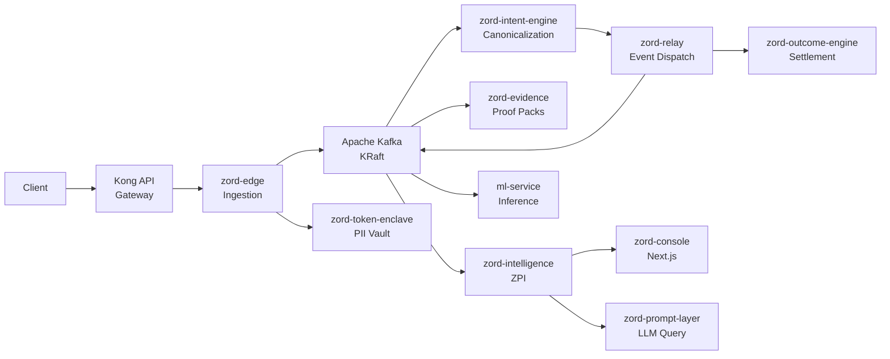
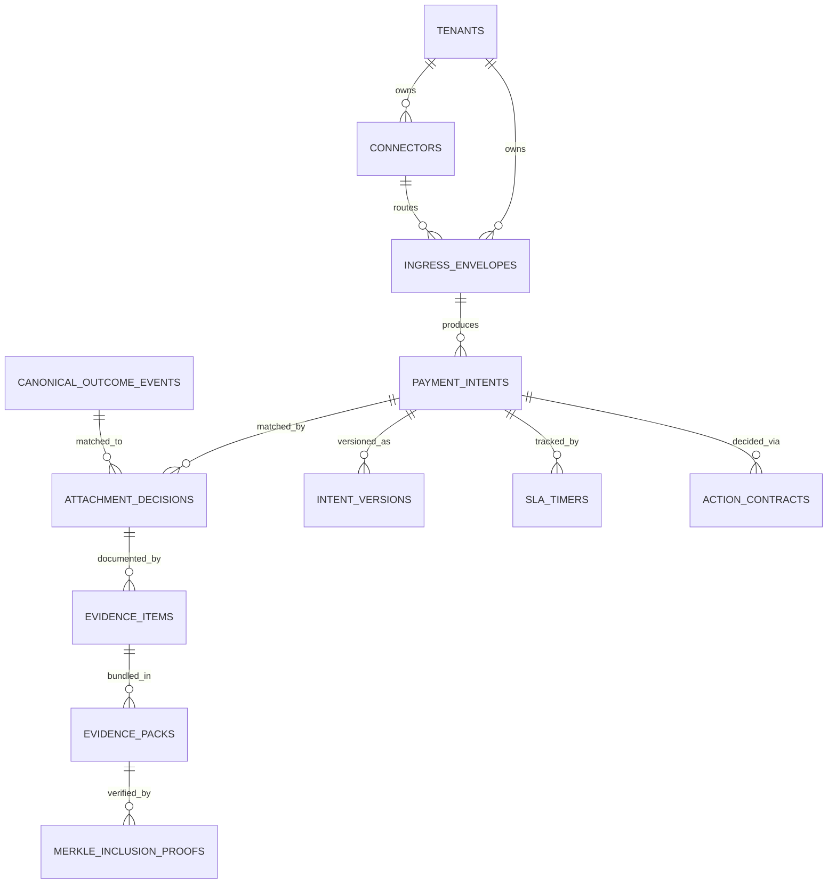

# Arealis Zord

A verifiable payment lifecycle platform. Ingestion, canonicalization, settlement reconciliation, evidence packaging, and predictive intelligence — orchestrated as independent services.

---

<!--  -->

<div align="center">


</div>

---

## Table of Contents

- [Problem](#problem)
- [Why Existing Systems Fail](#why-existing-systems-fail)
- [Solution](#solution)
- [Key Features](#key-features)
- [System Architecture](#system-architecture)
- [Repository Structure](#repository-structure)
- [Tech Stack](#tech-stack)
- [Getting Started](#getting-started)
- [Configuration](#configuration)
- [Razorpay Reconciliation (Phases 1-7)](#razorpay-reconciliation-phases-1-7)
- [API Documentation](#api-documentation)
- [Database Design](#database-design)
- [Workflow](#workflow)
- [Performance](#performance)
- [Security](#security)
- [Deployment](#deployment)
- [CI/CD](#cicd)
- [Testing](#testing)
- [Roadmap](#roadmap)
- [Contributing](#contributing)
- [License](#license)
- [Contact](#contact)

---

## Problem

Payment operations generate massive volumes of data across disconnected systems. Banks hold one version of truth. PSPs hold another. Settlement files tell a third story. Finance teams spend hours reconciling what actually happened — and they still can't prove it.

The core issue isn't that payments fail. It's that **payment truth becomes fragmented** the moment money moves across institutional boundaries. Every handoff — gateway to PSP, PSP to bank, bank to ledger — creates a seam where information is lost, delayed, or contradicted.

This fragmentation leads to:

- **Revenue leakage** that goes undetected for months
- **Ambiguous settlements** that no one can definitively match
- **Manual reconciliation** consuming thousands of hours per quarter
- **Dispute resolution** without a verifiable evidence trail
- **Compliance gaps** when audit trails are incomplete or inconsistent

---

## Why Existing Systems Fail

| Dimension | Current Process | Zord |
|---|---|---|
| **Reconciliation** | Manual spreadsheet matching across bank files, PSP exports, and internal ledgers | Automated attachment engine with confidence scoring and variance detection |
| **Evidence** | Scattered screenshots, email threads, and PDF exports assembled reactively | Cryptographically signed evidence packs with Merkle-tree integrity proofs |
| **Observability** | Siloed dashboards per system with no cross-system correlation | Unified projection engine with 7 intelligence families and real-time SLA tracking |
| **Dispute Handling** | Weeks of back-and-forth to compile supporting documentation | One-click dispute export with verifiable lineage and selective disclosure |
| **Audit Trail** | Partial logs across services, often incomplete after 90 days | Immutable intent versioning, action contracts, and finality certificates |
| **Leakage Detection** | Manual variance reports reviewed monthly | ML-powered leakage prediction with CatBoost regression and anomaly detection |

---

## Solution

Zord creates a **verifiable lifecycle** around payment events. Every intent is canonicalized, every outcome is correlated, every discrepancy is surfaced, and every decision is documented as an immutable action contract.

The platform operates on a simple principle: **payment truth should be provable, not assumed.**

Instead of asking finance teams to trust a single system's view, Zord constructs an independent, auditable record that spans ingestion, processing, settlement, and evidence — regardless of how many systems touch the money.

---

## Key Features

- **Payment Lifecycle Tracking** — End-to-end visibility from ingestion through settlement with immutable event lineage
- **Canonical Intent Engine** — Normalizes heterogeneous payment formats into a single, queryable schema
- **Automated Reconciliation** — Attachment engine matches intents to settlements with confidence scoring and variance analysis
- **Evidence Packaging** — Merkle-tree signed evidence packs with cryptographic verification and selective disclosure
- **Predictive Intelligence** — ML-powered leakage prediction, ambiguity detection, and SLA breach forecasting
- **Policy Engine** — DSL-based IF-THEN rules with 20+ seeded policies and immutable action contracts
- **Multi-Tenant Isolation** — Per-tenant databases, API keys, and connector configurations
- **Dead Letter Queue Management** — Structured DLQ with replay, retry, and investigation workflows
- **PII Tokenization** — Format-preserving encryption boundary for GDPR/PCI DSS compliance
- **Real-Time Dashboards** — Operator, customer, and admin views with role-based access control
- **Razorpay Connector** — Test/Live client, signed webhooks, payment API backfill, and canonical payment truth (Phases 1–4). Razorpay `settled` is never `bank_credited`

---

## System Architecture



---

## Repository Structure

```
Arealis-Zord/
├── backend/
│   ├── zord-edge/                  # Ingestion gateway (Go, port 8080)
│   ├── zord-intent-engine/         # Canonicalization engine (Go, port 8083)
│   ├── zord-relay/                 # Event relay and dispatch (Go, port 8082)
│   ├── zord-outcome-engine/        # Settlement processing (Go, port 8081)
│   │   ├── internal/poll/          # Razorpay client + payment/settlement backfill (Phases 1, 3)
│   │   ├── internal/observe/       # Webhook observation → payment truth (Phase 2+)
│   │   └── internal/paymenttruth/  # Canonical payment reducer (Phase 4)
│   ├── zord-evidence/              # Evidence pack generation (Go)
│   ├── zord-intelligence/          # ZPI — projections, policies, SLA (Go)
│   ├── zord-prompt-layer/          # LLM-assisted query (Go)
│   ├── zord-token-enclave/         # PII tokenization boundary (Go)
│   ├── zord-console/               # Next.js 14 full-stack UI (port 3000)
│   ├── ml-service/                 # ML inference via Kafka (Python/FastAPI)
│   ├── zord-airflow/               # Apache Airflow DAGs (Python)
│   ├── payout-smoke-simulator/     # Payout testing tool (Node.js)
│   ├── shared/                     # Event contracts and fixtures
│   └── generated/                  # Pre-trained ML model artifacts
├── kubernetes/
│   ├── api-gateway/                # Kong API Gateway manifests
│   ├── eks/                        # Core EKS Kustomize manifests
│   ├── argocd/                     # Argo CD GitOps
│   ├── monitoring/                 # Prometheus + Grafana
│   ├── logging/                    # EFK stack
│   └── tracing/                    # OpenTelemetry + Jaeger
├── jenkins/                        # CI/CD pipeline assets
├── functional-tests/               # End-to-end functional tests
├── performance-tests/              # Load and performance testing
├── docs/
│   └── razorpay/                   # Razorpay integration docs
│       ├── phase1-implementation-plan.md
│       └── test-mode-runbook.md
├── CONTRIBUTING.md
├── SECURITY.md
└── LICENSE
```

---

## Tech Stack

| Layer | Technology |
|---|---|
| **Language** | Go 1.24, TypeScript (strict), Python 3.11 |
| **Web Framework** | Gin (Go), Next.js 14 App Router (React), FastAPI (Python) |
| **Database** | PostgreSQL 16 (7 per-service databases) |
| **Message Queue** | Apache Kafka (KRaft mode, no ZooKeeper) |
| **Cache** | Redis |
| **Object Storage** | AWS S3 (encrypted) |
| **Frontend** | TailwindCSS, Framer Motion, Three.js, Recharts |
| **AI/ML** | scikit-learn, CatBoost, HDBSCAN, Gemini API |
| **Observability** | OpenTelemetry, Prometheus, Grafana, Jaeger |
| **Orchestration** | Kubernetes (AWS EKS), Docker Compose |
| **API Gateway** | Kong (DB-less, declarative YAML) |
| **CI/CD** | Jenkins, Argo CD, SonarQube |
| **Secrets** | AWS Secrets Manager, External Secrets Operator |
| **Auth** | JWT (HS256), API keys, ed25519 signing |
| **Compliance** | Format-preserving encryption, GDPR/PCI DSS tokenization |
| **PSP Integration** | Razorpay (Test/Live mode, Basic Auth, webhook-ready) |

---

## Getting Started

### Prerequisites

| Requirement | Version |
|---|---|
| Docker Desktop | Latest |
| Docker Compose | v2+ |
| Go | 1.24.x |
| Node.js | 18+ |
| npm | 9+ |

### Installation

```bash
git clone https://github.com/swaroopt14/razorpay-reconciliation.git
cd razorpay-reconciliation
```

### Start the full stack

```bash
docker-compose up -d --build
```

Services available:

| Service | URL |
|---|---|
| Console | http://localhost:3000 |
| Edge API | http://localhost:8080 |
| Intent Engine | http://localhost:8083 |
| Outcome Engine | http://localhost:8081 |
| Kafka | localhost:9092 |
| PostgreSQL | localhost:5432 |
| Redis | localhost:6379 |

### Run a single Go service

```bash
cd backend/zord-edge
go mod download
go run ./cmd/main.go
```

### Run the console locally

```bash
cd backend/zord-console
npm install
npm run dev
```

---

## Configuration

Each service reads configuration from environment variables. Copy `.env.example` to `.env` in each service directory.

### Core Variables

| Variable | Required | Description |
|---|---|---|
| `JWT_SIGNING_SECRET` | Yes | JWT signing key (change in production) |
| `ZORD_VAULT_KEY` | Yes | Base64-encoded vault encryption key |
| `S3_BUCKET` | Yes | AWS S3 bucket for file storage |
| `AWS_REGION` | Yes | AWS region (default: `ap-south-1`) |
| `DB_HOST` | Yes | PostgreSQL host |
| `DB_PORT` | Yes | PostgreSQL port (default: `5433` for local) |
| `DB_USER` | Yes | Database user |
| `DB_PASSWORD` | Yes | Database password |
| `DB_NAME` | Yes | Database name (service-specific) |
| `DB_SSLMODE` | Yes | SSL mode (`disable` for local) |

### Razorpay Connector Variables

| Variable | Required | Description |
|---|---|---|
| `RAZORPAY_ENABLED` | No | Enable Razorpay connector (`true`/`false`) |
| `RAZORPAY_MODE` | Yes | `test` or `live` |
| `RAZORPAY_API_BASE_URL` | Yes | Razorpay API base URL |
| `RAZORPAY_KEY_ID` | Yes | Razorpay API key ID |
| `RAZORPAY_KEY_SECRET` | Yes | Razorpay API key secret |
| `RAZORPAY_HTTP_TIMEOUT` | No | Request timeout (default: `10s`) |
| `RAZORPAY_MAX_RETRIES` | No | Max retry attempts (default: `3`) |
| `RAZORPAY_RETRY_BASE_DELAY` | No | Base delay for retries (default: `250ms`) |
| `RAZORPAY_MAX_PAGE_SIZE` | No | Max items per page (default: `100`) |

---

## Razorpay Reconciliation (Phases 1-7)

Work lives in this clone only. No new microservice. Edge never canonicalizes payments.

**Hard rule:** Razorpay `settled` is never `bank_credited`. Only a matched bank observation proves cash in the merchant account.

### Status

| Phase | Purpose | Status | Local test (2026-09-02) |
|---|---|---|---|
| **1** | Talk to Razorpay safely (REST client) | **Done** | `go test ./internal/poll/providers/razorpay/` pass. Test Mode health=`healthy` |
| **2** | Signed webhook → observation (not finality) | **Done** | `go test ./validator ./services ./handler` in `zord-edge` pass |
| **3** | Payments API backfill + provenance | **Done** | Integration tests against local Postgres pass |
| **4** | Canonical payment truth (reducer + `canonical_payments`) | **Done** | Unit + Postgres + `cmd/phase4-local` pass (see below) |
| **5A** | Settlement line truth (`provider_settlement_line_observations`) | **Done** | Imports + backfill upserts; duplicate file → `duplicate` |
| **5B** | Bank ingress + Settlement↔Bank **candidates** | **Done** | Edge `POST /v1/bank-statements`; `MatchSettlementBank`; no `fully_reconciled` |
| **6** | Payment-first financial recon + prompt-layer investigator | **Done** | PAY-001..008 unit + Postgres; `MATCHED` ≠ bank_credited |
| Refunds | Refund API + `refund.*` as money movement | **Not started** | — |
| Proof UI | Live console chips | **Not started** | — |

```
Razorpay Test Mode
        │
        ├──────── REST API ────────► zord-outcome-engine client (Phase 1)
        │                                    │
        └──────── Webhook ─────────► zord-edge HMAC + receipt (Phase 2)
                                             │
                         provider.observation.received
                                             │
                                             ▼
                           zord-outcome-engine /internal/observe
                                             │
                    ┌────────────────────────┴────────────────────────┐
                    │                                                 │
                    ▼                                                 ▼
     provider_payment_observation_events              payment API backfill (Phase 3)
     (immutable, identity-hashed)                     overlap window, sources[]
                    │                                                 │
                    └────────────────────────┬────────────────────────┘
                                             ▼
                           paymenttruth.Processor (Phase 4)
                           one RunInTx path for webhook + API
                                             │
                    ┌────────────────────────┼────────────────────────┐
                    ▼                        ▼                        ▼
           canonical_payments      GET /internal/payments/:id    payment.canonical.updated.v1
           (no backward status)    + observation history         outbox (status/amount/intent)
```

Not created on purpose: `zord-razorpay`, `zord-webhook-service`, `razorpay_connectors`.

### Phase 1 — Razorpay client

Secure Test/Live HTTP client in `backend/zord-outcome-engine/internal/poll/providers/razorpay/`.

Basic Auth, GET-only retry on 429/5xx/timeout, typed errors, redacted logs. Methods: `HealthCheck`, `FetchPayment`, `ListPayments` / `ListPaymentsPage`, `ListSettlementReconDay`.

Edge config API (does not call Razorpay except a **mock** `/test` leftover):

| Method | Endpoint |
|---|---|
| `POST` | `/v1/connectors/razorpay` |
| `POST` | `/v1/connectors/razorpay/test` |
| `GET` | `/v1/connectors/razorpay/status` |
| `GET` | `/v1/connectors` |

```bash
cd backend/zord-outcome-engine
go test ./internal/poll/providers/razorpay/ -count=1
```

### Phase 2 — Webhook observation

`zord-edge` verifies HMAC over the **raw body**, then persists `provider_webhook_receipts` + `ingress_outbox` in one TX.

- Routes: `POST /v1/webhooks/razorpay/:connectorID`, receipt GET/list
- Invalid signature → 401, nothing stored
- Same event + same hash → 200 `duplicate`, no second outbox
- Outbox event is `provider.observation.received` (not `payment.captured`)
- Handler does **not** rank `authorized` / `captured` / `failed`

```bash
cd backend/zord-edge
go test ./validator ./services ./handler -count=1
```

Outcome-engine `internal/observe` turns that envelope into a payment observation. Refund/settlement events are skipped.

### Phase 3 — API backfill

Gap-fill of Razorpay Payments API into the same observation store. Overlap window on `window_from` (default 10 minutes). Sources are `webhook` / `api_backfill` (not `razorpay`). Cursor does not advance if the page TX rolls back.

Airflow: `zord-airflow` backfill operator passes `overlap_minutes`.

### Phase 4 — Canonical payment truth

One current row in `canonical_payments`, many immutable rows in `provider_payment_observation_events`.

| Piece | Role |
|---|---|
| `internal/paymenttruth` | Mapper + lifecycle reducer |
| `Processor.Process` | Single path for webhook ingest and payment backfill, inside `RunInTx` |
| `GET /internal/payments/:payment_id` | Current canonical + observation history (`X-Relay-Token`) |
| `payment.canonical.updated.v1` | Outbox when status, amount, or intent link changes |

Status vocab stays recon lowercase: `created`, `authorized`, `captured`, `failed`, `refunded`, `partially_refunded`, `unknown`. Native Razorpay status is stored separately as `provider_status`.

Reducer: `unknown < created < authorized < captured < partially_refunded < refunded`. `failed` does not overwrite captured/refunded. Late `authorized` cannot regress `captured`.

Intent link is **exact only**: `canonical_intents.client_payout_ref` or `business_idempotency_key` = Razorpay `order_id`. Else `unlinked`. Never amount-only.

Migration: `backend/zord-outcome-engine/db/migrations/20260902050000_create_canonical_payments.sql`  
Applied on local Postgres `127.0.0.1:5433` database `zord_outcome_phase3`.

### Local test (Phase 4, this machine)

Postgres on `5433` was used. Razorpay Test Mode keys stay in gitignored `backend/zord-outcome-engine/.env`.

```bash
cd backend/zord-outcome-engine

# Unit (Phases 1, 3, 4 + observation processor)
go test ./internal/poll/providers/razorpay/ ./internal/paymenttruth/ \
  ./internal/poll/ ./internal/observe/ ./handlers/ -count=1

# Postgres integration
DATABASE_URL='postgres://postgres@127.0.0.1:5433/zord_outcome_phase3?sslmode=disable' \
  go test -tags=integration ./internal/persistence/ -count=1

# End-to-end against that DB: authorized → captured, late authorized stays captured,
# duplicate replay, GET /internal/payments/:id, optional Test Mode health
DATABASE_URL='postgres://postgres@127.0.0.1:5433/zord_outcome_phase3?sslmode=disable' \
  go run ./cmd/phase4-local
```

Last local run:

- `payment.authorized` → inserted
- `payment.captured` → updated
- late `payment.authorized` → canonical stayed **`captured`**
- replay captured → duplicate
- `GET /internal/payments/:id` → **200**, no email/contact in body
- Postgres row: `canonical_status=captured`, `sources={webhook}`, `intent_link=unlinked`
- Razorpay Test Mode: `health=healthy`, **0 payments** in the account (empty Test Mode is expected)

### Phase 5 — Settlement line truth, bank truth, Settlement↔Bank candidates

Phase 5 does **not** mark a payment fully reconciled. Razorpay `settled` is still never `bank_credited`.

**5A** extends `provider_settlement_line_observations` (imports + API backfill): `adjustment_minor`, statuses, file/row provenance, `payment_link` via exact `payment_id` → Phase 4 `canonical_payments`. Missing payment id is accepted as `unlinked`. Adjustment is never folded into fee. A second upload of the same file hash returns `status=duplicate` with `inserted_rows=0`.

The XLSX attachment engine and `canonical_settlement_observations` are unchanged.

**5B** Edge ingress (does not parse CSV, does not use payout `bank_parser.go`):

| Method | Endpoint |
|---|---|
| `POST` | `/v1/bank-statements` (multipart `file` + `account_id`) → 202 `ACCEPTED` or `DUPLICATE` |
| `GET` | `/v1/bank-statements/:ingest_id` |

Same hash records a `bank_ingest_runs` row as `DUPLICATE` and does **not** emit a second `bank.statement.received` outbox event. File bytes are stored via Edge S3 (`memory://hash` when S3 is unset).

Outcome-engine consumes via `POST /internal/bank-statements/ingest` (relay token) using the existing `internal/imports` CSV parser (generic + hdfc/icici/sbi). After commit, `MatchSettlementBank` writes `settlement_bank_match_decisions` only (`EXACT_MATCH` / `HIGH_CONFIDENCE` / `AMBIGUOUS` / `UNRESOLVED` / `CONFLICTED` / `ORPHAN_BANK`) and `bank.match.completed.v1`. It does not write `payment_proof_subjects` or emit `reconciliation.decision.v1`. DEBIT rows are never matched via `abs(amount)`.

```bash
cd backend/zord-outcome-engine
go test ./internal/imports/ ./internal/recon/ ./internal/poll/ ./internal/bankingest/ ./handlers/ -count=1
DATABASE_URL='postgres://postgres@127.0.0.1:5433/zord_outcome_phase3?sslmode=disable' \
  go test -tags=integration ./internal/persistence/ -count=1
cd backend/zord-edge && go test ./handler ./services -count=1
```

### Not in Phases 1–6

- Accounting ledger service
- Refund list/fetch/create API and `refund.*` as money movement
- New agent service, LangGraph, MCP
- Merkle / ed25519 finance packs (intent Merkle packs stay as they are)
- Live React proof chips
- Edge `POST /v1/connectors/razorpay/test` still returns a **mock** healthy result
- Live Razorpay keys (`RAZORPAY_ALLOW_LIVE` is refused)

### Phase 6 — Financial recon + prompt-layer investigation

Phase 6 consumes Phase 4 `canonical_payments` and Phase 5 `settlement_bank_match_decisions`. It does **not** re-parse files, re-score UTR, call `recon.Match()`, or write `payment_proof_subjects`. Razorpay lifecycle status and `reconciliation.result` stay separate. `MATCHED` is not `fully_reconciled` and not `bank_credited`.

Failed payments with no settlement and no bank movement are `MATCHED` (accounted; nothing moved) with **no** exception. Failed + unexplained bank CREDIT/DEBIT is `UNRESOLVED` + exception. AMBIGUOUS candidates are never forced to MATCHED. Open `authorized`/`created` past 72h stays that status (`UNRESOLVED` exception; not renamed `STUCK`).

### Phase 6B — Payouts + prompt-layer investigation graph

Payouts are a second first-class entity. Razorpay payout `status` is stored exactly (`pending | scheduled | queued | processing | processed | reversed | cancelled | rejected | failed`) and is never renamed to `STUCK` / `SLA_BREACH` / `SETTLED`. Processed payouts expect a bank **DEBIT**. Failed/cancelled/rejected with no bank movement is `MATCHED` (nothing moved). Open payouts past the 15m SLA stay that Razorpay status with `reconciliation.result=UNRESOLVED` and reason `payout_open_past_sla`.

`POST /v1/reconciliation/run` reconciles payments and payouts. Investigator lives in `zord-prompt-layer/agents/finance` (Go nodes + HTTP tools; no LangGraph/MCP/new service). `get_ledger_entry` stays `source_not_in_this_phase`.

| Method | Endpoint |
|---|---|
| `GET` | `/v1/reconciliation/payments/:payment_id` |
| `GET` | `/v1/reconciliation/payments/:payment_id/evidence` |
| `GET` | `/v1/reconciliation/payouts/:payout_id` |
| `GET` | `/v1/reconciliation/payouts/:payout_id/evidence` |
| `GET` | `/v1/reconciliation/sla-policy` |
| `GET` | `/v1/reconciliation/exceptions` and `/:id` (`entity_type`, `reason` filters) |
| `POST` | `/v1/reconciliation/run` |
| `GET` | `/v1/reconciliation/runs/:id` |
| `POST` | `/v1/reconciliation/investigations` |
| `GET` | `/v1/reconciliation/investigations/:id` |
| `POST` | `/internal/reconciliation/run` (relay) |
| `GET` | `/internal/payouts/:payout_id` (relay) |

Outbox: `reconciliation.decision.v1`, `payout.canonical.updated.v1`.

```bash
cd backend/zord-outcome-engine
go test ./internal/recon/ ./internal/payouttruth/ ./internal/observe/ ./internal/poll/providers/razorpay/ ./handlers/ -count=1
DATABASE_URL='postgres://postgres@127.0.0.1:5433/zord_outcome_phase3?sslmode=disable' \
  go test -tags=integration ./internal/persistence/ -count=1
cd backend/zord-prompt-layer && go test ./tools/ ./agents/finance/ -count=1
```

Tracked plan: [PHASE6_PLAN.md](./PHASE6_PLAN.md).

### Phase 7 — Evidence, provenance, decision/calc traces, audit, SHA-256 pack

Phase 6 finds the break. Phase 7 proves the break. Evidence lives in `zord-evidence/internal/finance/` beside existing intent Merkle packs (those 14-leaf packs are not reused). Each item is a **pointer + minimal immutable snapshot**, not a copy of the canonical row. Authority is AUTHORITATIVE → DERIVED → INFERRED. `UNKNOWN` is first-class; the agent cannot force UNKNOWN→PROVEN or AMBIGUOUS→MATCHED.

Outcome-engine emits `reconciliation.decision.v1` (now with `candidate_ids`, exception, currency) and `investigation.completed.v1`. `zord-evidence` consumes both idempotently. Integrity v1 is SHA-256 snapshot hash only (`VALID` / `INVALID` / `UNKNOWN`). Rejected AMBIGUOUS candidates are retained. Ledger / refund evidence types are reserved, not faked.

Prompt-layer tools (HTTP, not MCP): `get_evidence_pack`, `get_decision_trace`, `get_calculation_trace`, `get_audit_trail`, `verify_evidence`, `get_source_snapshot`. `get_ledger_entry` stays stubbed.

| Method | Endpoint |
|---|---|
| `POST` | `/internal/finance-evidence/ingest` |
| `GET` | `/v1/finance-evidence/entities/:entityType/:entityID` |
| `GET` | `/v1/finance-evidence/entities/:entityType/:entityID/audit` |
| `GET` | `/v1/finance-evidence/entities/:entityType/:entityID/decisions` |
| `GET` | `/v1/finance-evidence/entities/:entityType/:entityID/calculations` |
| `GET` | `/v1/finance-evidence/items/:evidenceID` |
| `POST` | `/v1/finance-evidence/items/:evidenceID/verify` |
| `GET` | `/v1/finance-evidence/packs/:investigationID` |

```bash
cd backend/zord-evidence && go test ./internal/finance/ -count=1
cd backend/zord-outcome-engine && go test ./internal/recon/ -count=1
cd backend/zord-prompt-layer && go test ./tools/ ./agents/finance/ -count=1
```

Tracked plan: [PHASE7_PLAN.md](./PHASE7_PLAN.md).

### Phase 8 — Ask Zord / Finance RAG

Ask Zord explains Phase 6/7 truth. It does **not** reconcile, re-score UTR, or invent amounts. `POST /v1/ask-zord/finance/query` (and finance questions on `POST /query`) use a Go router, HTTP tools, `GET /v1/reconciliation/summary`, Phase 7 evidence, and seeded glossary docs. Validators reject numeric / status / evidence hallucinations. `get_ledger_entry` stays stubbed. No MCP.

```bash
cd backend/zord-prompt-layer && go test ./agents/askzord/ ./tools/ ./agents/finance/ -count=1
cd backend/zord-outcome-engine && go test ./internal/recon/ ./handlers/ -count=1
```

Tracked plan: [PHASE8_PLAN.md](./PHASE8_PLAN.md).

### Phase 9 — Investigation Agent

Autonomous hypothesis loop on Phase 6 exceptions: plan → HTTP tools → confirm/eliminate hypotheses → copy structured impact → evidence-backed report. Not a chatbot, not RAG, not a second matcher. Lives in `zord-prompt-layer/agents/investigate/` (no `zord-agent-service`, no LangGraph, no live MCP). Never force `MATCHED` or rename Razorpay status. `PROVEN` is owned by the evidence policy (never assigned for failed+bank).

```bash
cd backend/zord-prompt-layer && go test ./agents/investigate/ ./tools/ ./agents/askzord/ ./agents/finance/ -count=1
```

Tracked plan: [PHASE9_PLAN.md](./PHASE9_PLAN.md).

### Phase 11 — Evaluation Harness

Labeled 100+ synthetic records (payment / payout / orphan) run through Phase 6 `Reconcile*`. Reports real Precision, Recall, F1, match rate, false-match rate, exception capture, variance detection, amount-weighted accuracy, evidence completeness, and latency. ROC-AUC / PR-AUC are omitted — recon is not a scored binary classifier. Regression vs the engine oracle must stay 1.0. Quality vs controller truth can be lower on known gaps (`partial_settlement`, `duplicate_settlement`).

```bash
cd backend/zord-outcome-engine && go test ./internal/recon/eval/ -count=1
go run ./cmd/phase11-eval
```

Tracked plan: [PHASE11_PLAN.md](./PHASE11_PLAN.md).

---

## API Documentation

### zord-edge — Ingestion Gateway

| Method | Endpoint | Description |
|---|---|---|
| `GET` | `/health` | Health check |
| `POST` | `/v1/admin/tenantReg` | Register new tenant |
| `GET` | `/v1/admin/tenants` | List all tenants |
| `POST` | `/v1/ingest` | JSON intent ingestion |
| `POST` | `/v1/bulk-ingest` | Multipart bulk file ingestion |
| `POST` | `/v1/connectors/razorpay` | Create Razorpay connector |
| `POST` | `/v1/connectors/razorpay/test` | Test Razorpay connection |
| `GET` | `/v1/connectors/razorpay/status` | Get connector status |
| `POST` | `/v1/raw/envelopes/webhooks/:provider/:connectorID` | Webhook intake |

#### Ingest a payment intent

```bash
curl -X POST http://localhost:8080/v1/ingest \
  -H "Content-Type: application/json" \
  -H "X-API-Key: your-api-key" \
  -H "X-Idempotency-Key: unique-request-id" \
  -d '{
    "amount": 1500.00,
    "currency": "USD",
    "beneficiary_name": "Acme Corp",
    "beneficiary_account": "1234567890",
    "reference": "INV-2025-0042",
    "originator": "client-xyz"
  }'
```

### zord-outcome-engine — Settlement Processing

| Method | Endpoint | Description |
|---|---|---|
| `GET` | `/v1/health` | Health check |
| `POST` | `/v1/settlement/upload` | Upload settlement file |
| `GET` | `/v1/settlement/jobs/:job_id` | Check job status |
| `POST` | `/v1/attachment/run` | Trigger attachment job |
| `POST` | `/internal/observations/provider` | Ingest `provider.observation.received` (relay token) |
| `GET` | `/internal/payments/:payment_id` | Canonical payment + observation history (relay token) |
| `POST` | `/internal/backfill/payments` | Queue Razorpay payments API backfill |
| `GET` | `/v1/reconciliation/payments/:payment_id` | Razorpay status + financial recon result (JWT) |
| `POST` | `/v1/reconciliation/run` | Run payment-first financial recon (JWT) |
| `GET` | `/v1/reconciliation/exceptions` | Unexplained money-movement exceptions |
| `GET` | `/v1/reconciliation/summary` | Result counts + exception exposure (Ask Zord aggregates) |

### zord-evidence — Evidence Packaging

| Method | Endpoint | Description |
|---|---|---|
| `POST` | `/v1/evidence/packs` | Generate evidence pack |
| `GET` | `/v1/evidence/packs` | List evidence packs |
| `GET` | `/v1/evidence/packs/:packID` | Get enriched pack |
| `POST` | `/v1/evidence/packs/:packID/verify` | Cryptographic verification |
| `POST` | `/v1/dispute/export` | Dispute export |
| `POST` | `/internal/finance-evidence/ingest` | Ingest Phase 6 decision / investigation (internal) |
| `GET` | `/v1/finance-evidence/entities/:entityType/:entityID` | List finance evidence for an entity |
| `GET` | `/v1/finance-evidence/items/:evidenceID` | Evidence pointer + snapshot |
| `POST` | `/v1/finance-evidence/items/:evidenceID/verify` | Recompute SHA-256 (`VALID`/`INVALID`/`UNKNOWN`) |
| `GET` | `/v1/finance-evidence/packs/:investigationID` | Sealed finance evidence pack |

### zord-intelligence — ZPI

| Method | Endpoint | Description |
|---|---|---|
| `GET` | `/v1/health` | Health check |
| `GET` | `/v1/projection` | Current projection state |
| `GET` | `/v1/policies` | List active policies |
| `GET` | `/v1/batch/:batchID` | Batch intelligence snapshot |

### zord-prompt-layer — LLM Query

| Method | Endpoint | Description |
|---|---|---|
| `GET` | `/health` | Health check |
| `POST` | `/query` | LLM-assisted query (finance questions dispatch to Ask Zord) |
| `POST` | `/v1/ask-zord/finance/query` | Structured finance answer (facts + evidence + limitations) |
| `POST` | `/v1/investigations` | Start a Phase 9 investigation loop (JWT) |
| `GET` | `/v1/investigations/:id` | Investigation report |
| `POST` | `/v1/investigations/:id/run` | Resume a paused / limit-reached loop |
| `GET` | `/v1/investigations/:id/trace` | Plan + tool calls + hypotheses |
| `POST` | `/v1/investigations/batch` | Prioritize exceptions by impact and investigate top-N |

```bash
curl -X POST http://localhost:8086/query \
  -H "Content-Type: application/json" \
  -d '{
    "tenant_id": "00000000-0000-0000-0000-000000000001",
    "query": "Show me all unresolved intents from the last 7 days"
  }'
```

---

## Database Design

Zord uses per-service PostgreSQL databases. Each service owns its schema and migrations.

### Core Relationships



### Key Tables

**zord-edge**
- `tenants` — Tenant registry with API key hashes
- `connectors` — Provider connections (razorpay, stripe, etc.) with mode, health status
- `ingress_envelopes` — Raw ingestion envelopes with metadata
- `ingress_outbox` — Transactional outbox for Kafka publishing

**zord-intent-engine**
- `payment_intents` — Canonical payment intents with scores and governance
- `intent_versions` — Immutable version chain for mutations
- `dlq_items` — Dead-letter queue for failed processing

**zord-outcome-engine**
- `canonical_payments` — Reduced current Razorpay payment truth (Phase 4)
- `provider_payment_observations` — Latest payment snapshot (webhook + API)
- `provider_payment_observation_events` — Immutable observation log (identity hash)
- `provider_settlement_line_observations` — Settlement-line truth (Phase 5A)
- `bank_transaction_observations` — Bank CREDIT/DEBIT observations (Phase 5B)
- `settlement_bank_match_decisions` — Settlement↔Bank candidates only (Phase 5B)
- `reconciliation_results` / `reconciliation_exceptions` — Payment-first financial recon (Phase 6)
- `canonical_payouts` / `provider_payout_observation_events` — Payout truth (Phase 6B)
- `canonical_settlement_observations` — Normalized settlement data
- `attachment_decisions` — Authoritative intent-to-settlement matching
- `finality_certificates` — Cryptographic settlement proofs

**zord-evidence**
- `evidence_packs` — Merkle-rooted evidence bundles
- `merkle_inclusion_proofs` — Selective disclosure proofs

**zord-intelligence**
- `projection_state` — Computed KPIs across 7 intelligence families
- `policy_registry` — DSL-based IF-THEN rules
- `action_contracts` — Immutable signed audit trail

---

## Security

| Layer | Implementation |
|---|---|
| **Authentication** | JWT (HS256) with MFA OTP via AWS SES |
| **Authorization** | Per-tenant API keys, role-based access (admin/ops/customer) |
| **Encryption at Rest** | AES-256 for S3 objects, format-preserving encryption for PII |
| **Encryption in Transit** | TLS 1.3 enforced via Kong gateway |
| **PII Protection** | Dedicated token enclave with format-preserving tokenization |
| **Integrity** | ed25519 signing on evidence packs, Merkle inclusion proofs |
| **Secrets Management** | AWS Secrets Manager with External Secrets Operator |
| **Connector Security** | Secrets stored by reference only, Basic Auth, redacted logging |
| **Rate Limiting** | Kong gateway rate limits per tenant and endpoint |
| **Audit Trail** | Immutable action contracts, version history, DLQ tracking |

> Read [SECURITY.md](./SECURITY.md) before deploying to any shared or production environment.

---

## Deployment

### Local Development

```bash
docker-compose up -d --build
```

### Kubernetes (AWS EKS)

Full manifests in `kubernetes/`:

```bash
kubectl apply -k kubernetes/eks/
kubectl apply -f kubernetes/api-gateway/
kubectl apply -f kubernetes/monitoring/
```

### AWS Deployment

- ECR registry: `522189039032.dkr.ecr.ap-south-1.amazonaws.com/zord/`
- Domain: `*.zordnet.com` via wildcard ACM certificate
- EKS with gp2 default StorageClass
- HPA on all services (CPU-based, 70% threshold)

---

## CI/CD

### Jenkins

| Pipeline | Purpose |
|---|---|
| `Jenkinsfile.all-services-ecr` | Full rebuild — builds and pushes all services |
| `Jenkinsfile.service-ecr` | Single service — builds and pushes one service |

### Pre-commit Hooks

```bash
pre-commit install
```

---

## Testing

### Razorpay Phases 1–6

```bash
# Phase 1 — client
cd backend/zord-outcome-engine
go test ./internal/poll/providers/razorpay/ -count=1

# Phase 2 — Edge webhook
cd backend/zord-edge
go test ./validator ./services ./handler -count=1

# Phase 3–4 — mapper, reducer, backfill, observe, HTTP
cd backend/zord-outcome-engine
go test ./internal/paymenttruth/ ./internal/poll/ ./internal/observe/ ./handlers/ -count=1

# Postgres (needs DATABASE_URL)
DATABASE_URL='postgres://postgres@127.0.0.1:5433/zord_outcome_phase3?sslmode=disable' \
  go test -tags=integration ./internal/persistence/ -count=1

# Phase 5–6 — settlement/bank candidates + financial recon
cd backend/zord-outcome-engine
go test ./internal/imports/ ./internal/recon/ ./internal/bankingest/ ./handlers/ -count=1
DATABASE_URL='postgres://postgres@127.0.0.1:5433/zord_outcome_phase3?sslmode=disable' \
  go test -tags=integration ./internal/persistence/ -count=1
cd backend/zord-prompt-layer && go test ./tools/ -count=1
```

### Functional Tests

```bash
cd functional-tests
npm install
npm test
```

### Console E2E (Playwright)

```bash
cd backend/zord-console
npx playwright test
```

---

## Roadmap

- [x] Razorpay connector — Phase 1 (client, config, health check, tests)
- [x] Razorpay webhook signature verification — Phase 2
- [x] `payment.captured` / `authorized` / `failed` as observations — Phase 2
- [x] Razorpay payments API backfill + provenance — Phase 3
- [x] Canonical payment truth (`canonical_payments` + reducer) — Phase 4
- [x] Settlement line truth + bank ingress + Settlement↔Bank candidates — Phase 5
- [x] Payment-first financial recon + prompt-layer HTTP investigator — Phase 6
- [x] Canonical payouts + payout recon + prompt-layer finance graph — Phase 6B
- [x] Ask Zord / Finance RAG — [PHASE8_PLAN.md](./PHASE8_PLAN.md)
- [x] Investigation agent (hypothesis loop) — [PHASE9_PLAN.md](./PHASE9_PLAN.md)
- [x] Evaluation harness (100+ labeled records, real metrics) — [PHASE11_PLAN.md](./PHASE11_PLAN.md)
- [ ] Razorpay refunds and mutations (next)
- [ ] Accounting ledger / `get_ledger_entry`
- [x] Phase 7 finance evidence / provenance / audit packs
- [ ] Live console proof chips
- [x] Batch settlement file scheduling via Airflow (DAGs already in tree)
- [ ] Real-time streaming dashboard (WebSocket)
- [ ] Multi-region EKS deployment
- [ ] Custom evidence pack templates
- [ ] SLA breach automated escalation workflows
- [ ] Terraform modules for AWS infrastructure

---

## Contributing

See [CONTRIBUTING.md](./CONTRIBUTING.md) for guidelines.

---

## License

MIT License. See [LICENSE](./LICENSE) for details.

---

## Contact

- **GitHub**: [swaroopt14](https://github.com/swaroopt14)
- **LinkedIn**: [Swaroop Thakare](https://www.linkedin.com/in/swaroop-thakare-136484259/)
