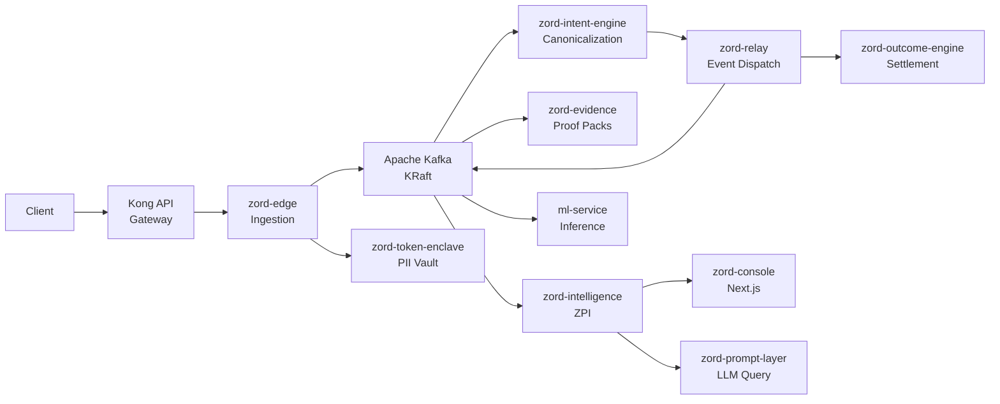
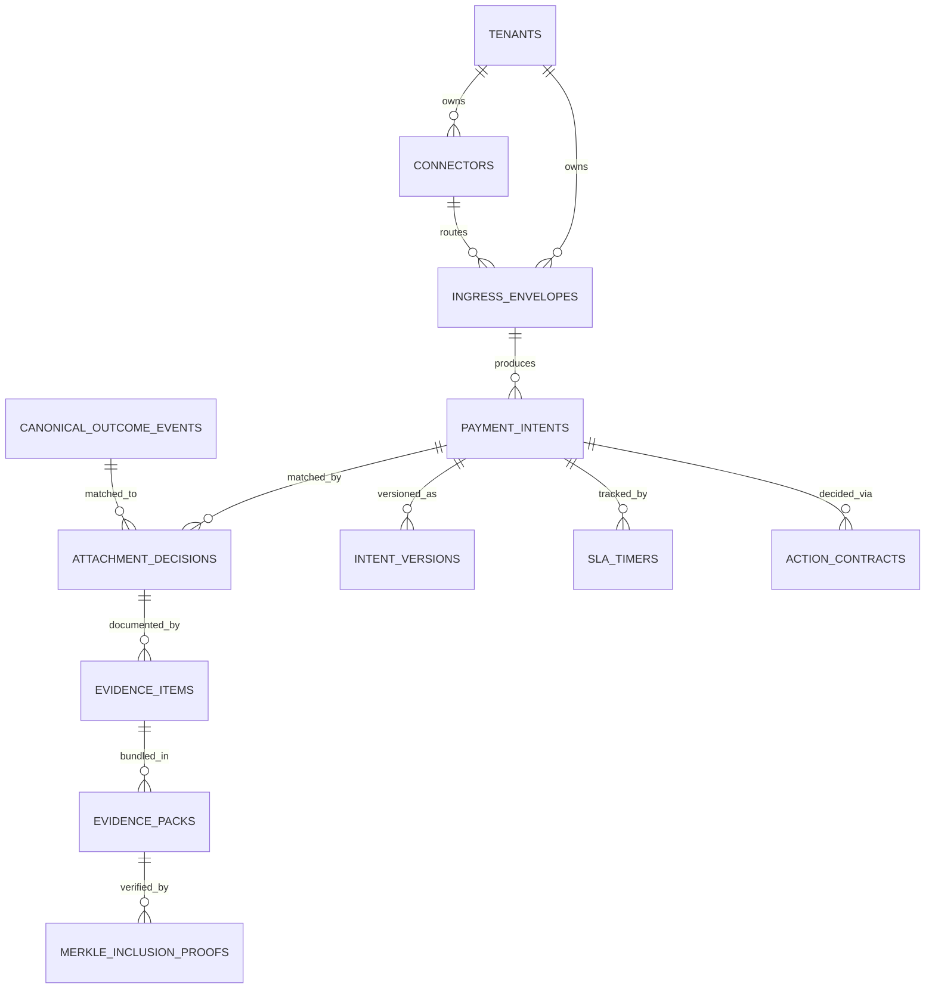

# Arealis Zord

A verifiable payment lifecycle platform. Ingestion, canonicalization, settlement reconciliation, evidence packaging, and predictive intelligence — orchestrated as independent services.

---

<!--  -->

<div align="center">


</div>

---

## Table of Contents

- [Problem](#problem)
- [Why Existing Systems Fail](#why-existing-systems-fail)
- [Solution](#solution)
- [Key Features](#key-features)
- [System Architecture](#system-architecture)
- [Repository Structure](#repository-structure)
- [Tech Stack](#tech-stack)
- [Getting Started](#getting-started)
- [Configuration](#configuration)
- [Razorpay Connector (Phase 1)](#razorpay-connector-phase-1)
- [API Documentation](#api-documentation)
- [Database Design](#database-design)
- [Workflow](#workflow)
- [Performance](#performance)
- [Security](#security)
- [Deployment](#deployment)
- [CI/CD](#cicd)
- [Testing](#testing)
- [Roadmap](#roadmap)
- [Contributing](#contributing)
- [License](#license)
- [Contact](#contact)

---

## Problem

Payment operations generate massive volumes of data across disconnected systems. Banks hold one version of truth. PSPs hold another. Settlement files tell a third story. Finance teams spend hours reconciling what actually happened — and they still can't prove it.

The core issue isn't that payments fail. It's that **payment truth becomes fragmented** the moment money moves across institutional boundaries. Every handoff — gateway to PSP, PSP to bank, bank to ledger — creates a seam where information is lost, delayed, or contradicted.

This fragmentation leads to:

- **Revenue leakage** that goes undetected for months
- **Ambiguous settlements** that no one can definitively match
- **Manual reconciliation** consuming thousands of hours per quarter
- **Dispute resolution** without a verifiable evidence trail
- **Compliance gaps** when audit trails are incomplete or inconsistent

---

## Why Existing Systems Fail

| Dimension | Current Process | Zord |
|---|---|---|
| **Reconciliation** | Manual spreadsheet matching across bank files, PSP exports, and internal ledgers | Automated attachment engine with confidence scoring and variance detection |
| **Evidence** | Scattered screenshots, email threads, and PDF exports assembled reactively | Cryptographically signed evidence packs with Merkle-tree integrity proofs |
| **Observability** | Siloed dashboards per system with no cross-system correlation | Unified projection engine with 7 intelligence families and real-time SLA tracking |
| **Dispute Handling** | Weeks of back-and-forth to compile supporting documentation | One-click dispute export with verifiable lineage and selective disclosure |
| **Audit Trail** | Partial logs across services, often incomplete after 90 days | Immutable intent versioning, action contracts, and finality certificates |
| **Leakage Detection** | Manual variance reports reviewed monthly | ML-powered leakage prediction with CatBoost regression and anomaly detection |

---

## Solution

Zord creates a **verifiable lifecycle** around payment events. Every intent is canonicalized, every outcome is correlated, every discrepancy is surfaced, and every decision is documented as an immutable action contract.

The platform operates on a simple principle: **payment truth should be provable, not assumed.**

Instead of asking finance teams to trust a single system's view, Zord constructs an independent, auditable record that spans ingestion, processing, settlement, and evidence — regardless of how many systems touch the money.

---

## Key Features

- **Payment Lifecycle Tracking** — End-to-end visibility from ingestion through settlement with immutable event lineage
- **Canonical Intent Engine** — Normalizes heterogeneous payment formats into a single, queryable schema
- **Automated Reconciliation** — Attachment engine matches intents to settlements with confidence scoring and variance analysis
- **Evidence Packaging** — Merkle-tree signed evidence packs with cryptographic verification and selective disclosure
- **Predictive Intelligence** — ML-powered leakage prediction, ambiguity detection, and SLA breach forecasting
- **Policy Engine** — DSL-based IF-THEN rules with 20+ seeded policies and immutable action contracts
- **Multi-Tenant Isolation** — Per-tenant databases, API keys, and connector configurations
- **Dead Letter Queue Management** — Structured DLQ with replay, retry, and investigation workflows
- **PII Tokenization** — Format-preserving encryption boundary for GDPR/PCI DSS compliance
- **Real-Time Dashboards** — Operator, customer, and admin views with role-based access control
- **Razorpay Connector** — Secure provider client with Test/Live mode, Basic Auth, retry, and redacted logging

---

## System Architecture



---

## Repository Structure

```
Arealis-Zord/
├── backend/
│   ├── zord-edge/                  # Ingestion gateway (Go, port 8080)
│   ├── zord-intent-engine/         # Canonicalization engine (Go, port 8083)
│   ├── zord-relay/                 # Event relay and dispatch (Go, port 8082)
│   ├── zord-outcome-engine/        # Settlement processing (Go, port 8081)
│   │   └── internal/poll/          # ← Razorpay provider client (Phase 1)
│   ├── zord-evidence/              # Evidence pack generation (Go)
│   ├── zord-intelligence/          # ZPI — projections, policies, SLA (Go)
│   ├── zord-prompt-layer/          # LLM-assisted query (Go)
│   ├── zord-token-enclave/         # PII tokenization boundary (Go)
│   ├── zord-console/               # Next.js 14 full-stack UI (port 3000)
│   ├── ml-service/                 # ML inference via Kafka (Python/FastAPI)
│   ├── zord-airflow/               # Apache Airflow DAGs (Python)
│   ├── payout-smoke-simulator/     # Payout testing tool (Node.js)
│   ├── shared/                     # Event contracts and fixtures
│   └── generated/                  # Pre-trained ML model artifacts
├── kubernetes/
│   ├── api-gateway/                # Kong API Gateway manifests
│   ├── eks/                        # Core EKS Kustomize manifests
│   ├── argocd/                     # Argo CD GitOps
│   ├── monitoring/                 # Prometheus + Grafana
│   ├── logging/                    # EFK stack
│   └── tracing/                    # OpenTelemetry + Jaeger
├── jenkins/                        # CI/CD pipeline assets
├── functional-tests/               # End-to-end functional tests
├── performance-tests/              # Load and performance testing
├── docs/
│   └── razorpay/                   # Razorpay integration docs
│       ├── phase1-implementation-plan.md
│       └── test-mode-runbook.md
├── CONTRIBUTING.md
├── SECURITY.md
└── LICENSE
```

---

## Tech Stack

| Layer | Technology |
|---|---|
| **Language** | Go 1.24, TypeScript (strict), Python 3.11 |
| **Web Framework** | Gin (Go), Next.js 14 App Router (React), FastAPI (Python) |
| **Database** | PostgreSQL 16 (7 per-service databases) |
| **Message Queue** | Apache Kafka (KRaft mode, no ZooKeeper) |
| **Cache** | Redis |
| **Object Storage** | AWS S3 (encrypted) |
| **Frontend** | TailwindCSS, Framer Motion, Three.js, Recharts |
| **AI/ML** | scikit-learn, CatBoost, HDBSCAN, Gemini API |
| **Observability** | OpenTelemetry, Prometheus, Grafana, Jaeger |
| **Orchestration** | Kubernetes (AWS EKS), Docker Compose |
| **API Gateway** | Kong (DB-less, declarative YAML) |
| **CI/CD** | Jenkins, Argo CD, SonarQube |
| **Secrets** | AWS Secrets Manager, External Secrets Operator |
| **Auth** | JWT (HS256), API keys, ed25519 signing |
| **Compliance** | Format-preserving encryption, GDPR/PCI DSS tokenization |
| **PSP Integration** | Razorpay (Test/Live mode, Basic Auth, webhook-ready) |

---

## Getting Started

### Prerequisites

| Requirement | Version |
|---|---|
| Docker Desktop | Latest |
| Docker Compose | v2+ |
| Go | 1.24.x |
| Node.js | 18+ |
| npm | 9+ |

### Installation

```bash
git clone https://github.com/swaroopt14/razorpay-reconciliation.git
cd razorpay-reconciliation
```

### Start the full stack

```bash
docker-compose up -d --build
```

Services available:

| Service | URL |
|---|---|
| Console | http://localhost:3000 |
| Edge API | http://localhost:8080 |
| Intent Engine | http://localhost:8083 |
| Outcome Engine | http://localhost:8081 |
| Kafka | localhost:9092 |
| PostgreSQL | localhost:5432 |
| Redis | localhost:6379 |

### Run a single Go service

```bash
cd backend/zord-edge
go mod download
go run ./cmd/main.go
```

### Run the console locally

```bash
cd backend/zord-console
npm install
npm run dev
```

---

## Configuration

Each service reads configuration from environment variables. Copy `.env.example` to `.env` in each service directory.

### Core Variables

| Variable | Required | Description |
|---|---|---|
| `JWT_SIGNING_SECRET` | Yes | JWT signing key (change in production) |
| `ZORD_VAULT_KEY` | Yes | Base64-encoded vault encryption key |
| `S3_BUCKET` | Yes | AWS S3 bucket for file storage |
| `AWS_REGION` | Yes | AWS region (default: `ap-south-1`) |
| `DB_HOST` | Yes | PostgreSQL host |
| `DB_PORT` | Yes | PostgreSQL port (default: `5433` for local) |
| `DB_USER` | Yes | Database user |
| `DB_PASSWORD` | Yes | Database password |
| `DB_NAME` | Yes | Database name (service-specific) |
| `DB_SSLMODE` | Yes | SSL mode (`disable` for local) |

### Razorpay Connector Variables

| Variable | Required | Description |
|---|---|---|
| `RAZORPAY_ENABLED` | No | Enable Razorpay connector (`true`/`false`) |
| `RAZORPAY_MODE` | Yes | `test` or `live` |
| `RAZORPAY_API_BASE_URL` | Yes | Razorpay API base URL |
| `RAZORPAY_KEY_ID` | Yes | Razorpay API key ID |
| `RAZORPAY_KEY_SECRET` | Yes | Razorpay API key secret |
| `RAZORPAY_HTTP_TIMEOUT` | No | Request timeout (default: `10s`) |
| `RAZORPAY_MAX_RETRIES` | No | Max retry attempts (default: `3`) |
| `RAZORPAY_RETRY_BASE_DELAY` | No | Base delay for retries (default: `250ms`) |
| `RAZORPAY_MAX_PAGE_SIZE` | No | Max items per page (default: `100`) |

---

## Razorpay Connector (Phase 1)

Phase 1 establishes a secure, testable Razorpay provider client. The connector flow:

```
Tenant connector configuration
        ↓
Test/Live credential resolution
        ↓
Authenticated Razorpay API request (Basic Auth)
        ↓
Typed provider response
        ↓
Redacted audit log and metrics
        ↓
Connection-test result
```

### Architecture

| Component | Location | Responsibility |
|---|---|---|
| **Edge Connector API** | `zord-edge/handler/connector_handler.go` | CRUD, tenant auth, health status |
| **Edge Connector Service** | `zord-edge/services/connector_service.go` | DB ops, secret resolution |
| **Edge Connector Model** | `zord-edge/model/connector.go` | Types, request/response DTOs |
| **Provider Interface** | `zord-outcome-engine/internal/poll/provider.go` | Provider-neutral interface |
| **Razorpay Client** | `zord-outcome-engine/internal/poll/providers/razorpay/client.go` | HTTP client, Basic Auth, retry |
| **Razorpay Config** | `zord-outcome-engine/internal/poll/providers/razorpay/config.go` | Validation, mode enforcement |
| **Razorpay Types** | `zord-outcome-engine/internal/poll/providers/razorpay/types.go` | Provider DTOs (not exposed to frontend) |
| **Error Classification** | `zord-outcome-engine/internal/poll/providers/razorpay/errors.go` | Typed error categories |
| **Redaction Helpers** | `zord-outcome-engine/internal/poll/providers/razorpay/redact.go` | Safe logging |
| **Database Migration** | `zord-edge/db/migrations/20260826_add_razorpay_connector_fields.sql` | Extends connectors table |

### Connector API Endpoints

| Method | Endpoint | Description |
|---|---|---|
| `POST` | `/v1/connectors/razorpay` | Save connector config |
| `POST` | `/v1/connectors/razorpay/test` | Run connection test |
| `GET` | `/v1/connectors/razorpay/status` | Get health status |
| `GET` | `/v1/connectors` | List all connectors |

### Quick Start (Local Testing)

```bash
# 1. Configure connector
curl -X POST http://localhost:8080/v1/connectors/razorpay \
  -H 'Content-Type: application/json' \
  -H 'Authorization: Bearer <your-token>' \
  -d '{
    "mode": "test",
    "key_id": "rzp_test_TVY5EjjWRxV6HQ",
    "key_secret": "<your-secret>"
  }'

# 2. Run connection test
curl -X POST http://localhost:8080/v1/connectors/razorpay/test \
  -H 'Content-Type: application/json' \
  -H 'Authorization: Bearer <your-token>' \
  -d '{"connector_id":"<connector-id>"}'

# 3. Check status
curl http://localhost:8080/v1/connectors/razorpay/status \
  -H 'Authorization: Bearer <your-token>'
```

### Test Suite (45 tests)

```bash
cd backend/zord-outcome-engine
go test ./internal/poll/providers/razorpay/... -v
```

Tests cover:
- Basic Auth header generation
- Correct HTTP method, path, and headers
- Response decoding (200 → typed DTO)
- Error classification (400, 401, 403, 404, 429, 500)
- Retry behavior (429/5xx retries, 4xx no retry)
- Context cancellation and deadline
- Pagination helpers
- Redaction (no secrets in logs)
- Health check success and failure

### What Phase 1 Does NOT Do

- Webhook signature validation
- payment.captured event processing
- Settlement reconciliation
- Bank statement ingestion
- UTR matching
- Razorpay mutations/refunds
- AI agent actions

---

## API Documentation

### zord-edge — Ingestion Gateway

| Method | Endpoint | Description |
|---|---|---|
| `GET` | `/health` | Health check |
| `POST` | `/v1/admin/tenantReg` | Register new tenant |
| `GET` | `/v1/admin/tenants` | List all tenants |
| `POST` | `/v1/ingest` | JSON intent ingestion |
| `POST` | `/v1/bulk-ingest` | Multipart bulk file ingestion |
| `POST` | `/v1/connectors/razorpay` | Create Razorpay connector |
| `POST` | `/v1/connectors/razorpay/test` | Test Razorpay connection |
| `GET` | `/v1/connectors/razorpay/status` | Get connector status |
| `POST` | `/v1/raw/envelopes/webhooks/:provider/:connectorID` | Webhook intake |

#### Ingest a payment intent

```bash
curl -X POST http://localhost:8080/v1/ingest \
  -H "Content-Type: application/json" \
  -H "X-API-Key: your-api-key" \
  -H "X-Idempotency-Key: unique-request-id" \
  -d '{
    "amount": 1500.00,
    "currency": "USD",
    "beneficiary_name": "Acme Corp",
    "beneficiary_account": "1234567890",
    "reference": "INV-2025-0042",
    "originator": "client-xyz"
  }'
```

### zord-outcome-engine — Settlement Processing

| Method | Endpoint | Description |
|---|---|---|
| `GET` | `/v1/health` | Health check |
| `POST` | `/v1/settlement/upload` | Upload settlement file |
| `GET` | `/v1/settlement/jobs/:job_id` | Check job status |
| `POST` | `/v1/attachment/run` | Trigger attachment job |

### zord-evidence — Evidence Packaging

| Method | Endpoint | Description |
|---|---|---|
| `POST` | `/v1/evidence/packs` | Generate evidence pack |
| `GET` | `/v1/evidence/packs` | List evidence packs |
| `GET` | `/v1/evidence/packs/:packID` | Get enriched pack |
| `POST` | `/v1/evidence/packs/:packID/verify` | Cryptographic verification |
| `POST` | `/v1/dispute/export` | Dispute export |

### zord-intelligence — ZPI

| Method | Endpoint | Description |
|---|---|---|
| `GET` | `/v1/health` | Health check |
| `GET` | `/v1/projection` | Current projection state |
| `GET` | `/v1/policies` | List active policies |
| `GET` | `/v1/batch/:batchID` | Batch intelligence snapshot |

### zord-prompt-layer — LLM Query

| Method | Endpoint | Description |
|---|---|---|
| `GET` | `/health` | Health check |
| `POST` | `/query` | LLM-assisted query |

```bash
curl -X POST http://localhost:8086/query \
  -H "Content-Type: application/json" \
  -d '{
    "tenant_id": "00000000-0000-0000-0000-000000000001",
    "query": "Show me all unresolved intents from the last 7 days"
  }'
```

---

## Database Design

Zord uses per-service PostgreSQL databases. Each service owns its schema and migrations.

### Core Relationships



### Key Tables

**zord-edge**
- `tenants` — Tenant registry with API key hashes
- `connectors` — Provider connections (razorpay, stripe, etc.) with mode, health status
- `ingress_envelopes` — Raw ingestion envelopes with metadata
- `ingress_outbox` — Transactional outbox for Kafka publishing

**zord-intent-engine**
- `payment_intents` — Canonical payment intents with scores and governance
- `intent_versions` — Immutable version chain for mutations
- `dlq_items` — Dead-letter queue for failed processing

**zord-outcome-engine**
- `canonical_settlement_observations` — Normalized settlement data
- `attachment_decisions` — Authoritative intent-to-settlement matching
- `finality_certificates` — Cryptographic settlement proofs

**zord-evidence**
- `evidence_packs` — Merkle-rooted evidence bundles
- `merkle_inclusion_proofs` — Selective disclosure proofs

**zord-intelligence**
- `projection_state` — Computed KPIs across 7 intelligence families
- `policy_registry` — DSL-based IF-THEN rules
- `action_contracts` — Immutable signed audit trail

---

## Security

| Layer | Implementation |
|---|---|
| **Authentication** | JWT (HS256) with MFA OTP via AWS SES |
| **Authorization** | Per-tenant API keys, role-based access (admin/ops/customer) |
| **Encryption at Rest** | AES-256 for S3 objects, format-preserving encryption for PII |
| **Encryption in Transit** | TLS 1.3 enforced via Kong gateway |
| **PII Protection** | Dedicated token enclave with format-preserving tokenization |
| **Integrity** | ed25519 signing on evidence packs, Merkle inclusion proofs |
| **Secrets Management** | AWS Secrets Manager with External Secrets Operator |
| **Connector Security** | Secrets stored by reference only, Basic Auth, redacted logging |
| **Rate Limiting** | Kong gateway rate limits per tenant and endpoint |
| **Audit Trail** | Immutable action contracts, version history, DLQ tracking |

> Read [SECURITY.md](./SECURITY.md) before deploying to any shared or production environment.

---

## Deployment

### Local Development

```bash
docker-compose up -d --build
```

### Kubernetes (AWS EKS)

Full manifests in `kubernetes/`:

```bash
kubectl apply -k kubernetes/eks/
kubectl apply -f kubernetes/api-gateway/
kubectl apply -f kubernetes/monitoring/
```

### AWS Deployment

- ECR registry: `522189039032.dkr.ecr.ap-south-1.amazonaws.com/zord/`
- Domain: `*.zordnet.com` via wildcard ACM certificate
- EKS with gp2 default StorageClass
- HPA on all services (CPU-based, 70% threshold)

---

## CI/CD

### Jenkins

| Pipeline | Purpose |
|---|---|
| `Jenkinsfile.all-services-ecr` | Full rebuild — builds and pushes all services |
| `Jenkinsfile.service-ecr` | Single service — builds and pushes one service |

### Pre-commit Hooks

```bash
pre-commit install
```

---

## Testing

### Razorpay Client Tests (45 tests)

```bash
cd backend/zord-outcome-engine
go test ./internal/poll/providers/razorpay/... -v -count=1
```

### Functional Tests

```bash
cd functional-tests
npm install
npm test
```

### Console E2E (Playwright)

```bash
cd backend/zord-console
npx playwright test
```

---

## Roadmap

- [x] Razorpay connector — Phase 1 (client, config, health check, tests)
- [ ] Razorpay webhook signature verification (Phase 2)
- [ ] payment.captured event processing (Phase 2)
- [ ] Settlement reconciliation with Razorpay (Phase 3)
- [ ] Bank statement ingestion and UTR matching (Phase 3)
- [ ] Razorpay refunds and mutations (Phase 4)
- [ ] AI-powered payment recovery agents (Phase 5)
- [ ] Batch settlement file scheduling via Airflow
- [ ] Real-time streaming dashboard (WebSocket)
- [ ] Multi-region EKS deployment
- [ ] Custom evidence pack templates
- [ ] SLA breach automated escalation workflows
- [ ] Terraform modules for AWS infrastructure

---

## Contributing

See [CONTRIBUTING.md](./CONTRIBUTING.md) for guidelines.

---

## License

MIT License. See [LICENSE](./LICENSE) for details.

---

## Contact

- **GitHub**: [swaroopt14](https://github.com/swaroopt14)
- **LinkedIn**: [Swaroop Thakare](https://www.linkedin.com/in/swaroop-thakare-136484259/)
