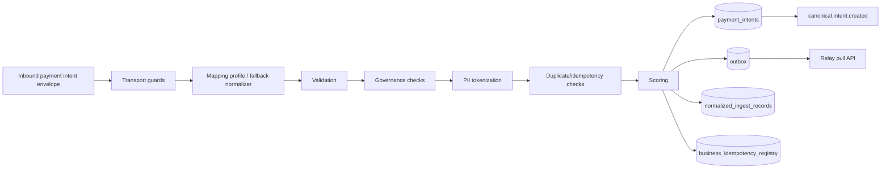
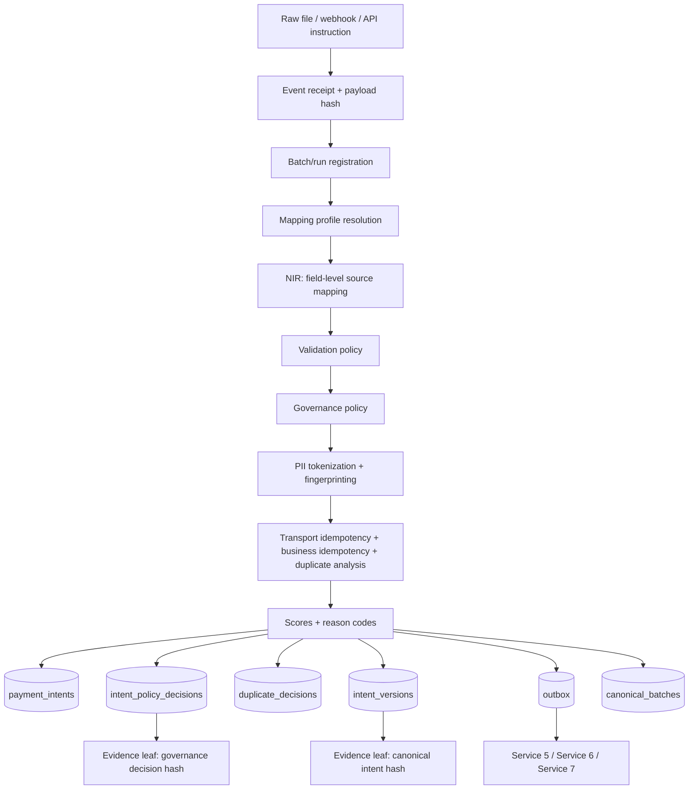
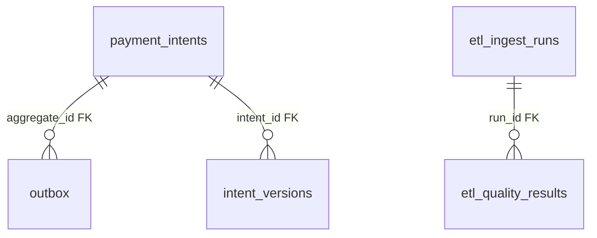
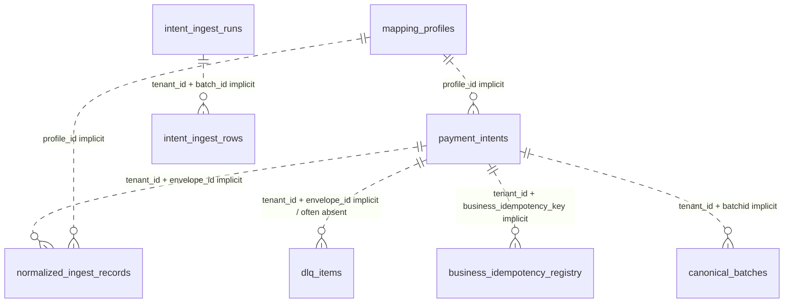
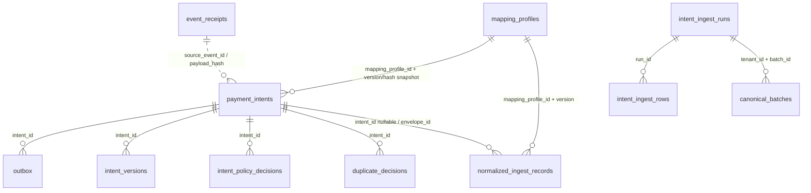

# ZORD Service 2 — Intent Engine Production-Grade Refactor Blueprint

**Service:** `zord-intent-engine`  
**Role in Zord:** Payment instruction intake, canonicalization, governance, duplicate/replay protection, evidence-ready intent truth.  
**Audience:** Backend developer / engineering lead.  
**Version:** 2026-07-07  
**Primary source:** `ZORD_INTENT_ENGINE_Database_Architecture_Handbook.docx`, plus current Zord product context and prior audit/fix discussions.

---

## 0. Executive Decision

Service 2 must not be treated as a parser. It is the **Payment Instruction Truth Gate** for Zord.

A normal system asks:

```text
Can we parse this payment file?
```

Zord Service 2 must ask:

```text
Can this payment instruction be trusted enough to become canonical operational truth?
```

Therefore Service 2 must produce a payment intent that is:

```text
1. tenant-scoped
2. source-traceable
3. mapping-profile-versioned
4. policy-evaluated
5. duplicate/replay-safe
6. PII-tokenized
7. score-explained
8. evidence-ready
9. outbox-deliverable
10. batch-accountable
```

The current implementation already has strong primitives: Kafka intake, validation, canonicalization, PII tokenization through an enclave path, business idempotency, normalized ingest records, DLQ, transactional outbox, batch rollups, and scoring. But it also has production-grade problems: schema drift, too many hardcoded rules, weak policy configurability, tenant/batch scoping risks, batch aggregate drift, dead fields, disconnected audit systems, unclear scoring semantics, and missing payment-control concepts.

This document tells the developer exactly what to fix, why it matters, how to implement it, and how to test it.

---

## 1. Current Service Responsibility

### 1.1 What the service currently does



### 1.2 What it must become



---

## 2. Non-Negotiable Design Rules

### Rule 1 — Tenant is never optional

Every table that stores business data must carry `tenant_id`. Every repository read/write must include tenant scope. There should be no method like:

```sql
SELECT * FROM payment_intents WHERE intent_id = $1;
```

Correct:

```sql
SELECT * FROM payment_intents WHERE tenant_id = $1 AND intent_id = $2;
```

### Rule 2 — Batch identity is tenant-scoped

`batch_id` is client-supplied and not globally unique.

Correct key:

```text
(tenant_id, batch_id)
```

Never use `batch_id` alone as a unique key or lookup key.

### Rule 3 — Source row lineage must not be lost

Every accepted or rejected row must remain traceable to:

```text
source_system
source_file_id / file_hash
source_row_num
raw_row_hash
mapping_profile_id
mapping_profile_version
mapping_profile_hash
```

### Rule 4 — Policy must be versioned

A payment decision without policy version is not defensible.

Every accepted/rejected/held intent must carry:

```text
policy_source
policy_version
policy_hash
policy_decision_id
policy_result
reason_codes
input_facts_hash
```

### Rule 5 — Scores must be named by what they measure

Do not use generic `confidence_score`.

Use:

```text
schema_completeness_score
mapping_confidence_score
intent_quality_score
duplicate_risk_score
proof_readiness_score
dispatch_readiness_score
```

### Rule 6 — Dead fields must either be wired or deprecated

Dead columns create false confidence. Do not leave fields like `salient_hash = 'NA'` or `confidence_score = nil` without formal deprecation.

### Rule 7 — Intent output must be evidence-ready

Service 2 must emit the hashes Service 6 needs:

```text
ENVELOPE_HASH
PAYLOAD_HASH
RAW_ROW_HASH
CANONICAL_INTENT_HASH
MAPPING_PROFILE_HASH
GOVERNANCE_DECISION_HASH
BUSINESS_IDEMPOTENCY_HASH
TOKENIZATION_STATUS_HASH
```

---

## 3. Current Database Relationship Map

### 3.1 Enforced relationships today



Only these relationships are DB-enforced. Most other relationships are text/UUID conventions.

### 3.2 Important implicit relationships today



### 3.3 Target relationship map



---

## 4. Problem-by-Problem Refactor Ledger

| # | Severity | Problem | Why it matters | Required fix |
|---|---|---|---|---|
| 1 | P0 | Runtime schema is created by Go `CreateTables`; `init.sql` is dead/stale | Production schema can drift, environments become non-reproducible | Move to formal migrations; startup validates schema only |
| 2 | P0 | Tenant scoping historically inconsistent at read layer | Cross-tenant payment data leak | Every repository requires tenant; verify RLS/current tenant context |
| 3 | P0 | Batch IDs were not tenant-scoped | Different tenants can collide on same batch name | Enforce `(tenant_id, batch_id)` everywhere |
| 4 | P0 | `canonical_batches` can drift from `payment_intents` | Relay can treat batch as complete while rows still missing | Use explicit batch lifecycle + invariant counters |
| 5 | P1 | `payment_intents` is too wide but also missing decision structure | Intent truth, policy, scores, mapping, and source data are mixed | Keep canonical row but move decision details to child tables |
| 6 | P1 | Mapping-profile policy JSON is stored but not read | Tenant-specific intake policy is fake | Wire profile policy into validation/governance |
| 7 | P1 | Tenant synonym table exists but loader is stub | Customers cannot adapt column names without code | Implement `tenant_synonym_profiles` loading/cache invalidation |
| 8 | P1 | Important validation rules are commented out | Bad payment data can pass silently | Make checks policy-driven: reject/warn/review |
| 9 | P1 | Currency validation conflicts with INR-only preguard | Same intent can pass one stage and fail later | Single currency policy per mode/tenant |
| 10 | P1 | Preguard constants exist but are not enforced | Amount/batch/day controls are decorative | Add policy-configured limits and reason codes |
| 11 | P1 | Strict duplicate detection branches are unreachable | Strong duplicate signals are not used | Add strict duplicate checks for idempotency key/client ref/source row |
| 12 | P1 | Duplicate risk conflates confirmed duplicate and risk signal | False positives and weak customer explanation | Create `duplicate_decisions` with decision, score, compared intent |
| 13 | P1 | `salient_hash` always equals `NA` | False tamper-evidence surface | Deprecate or replace with `instruction_fingerprint_hash` |
| 14 | P1 | `confidence_score` is nil/dead | Frontend/downstream may misread empty value | Deprecate; replace with named scores only |
| 15 | P1 | Scores are not semantically clean | Product can show misleading KPIs | Version score formulas and expose breakdown |
| 16 | P1 | `business_state` is always `NEW` | No real payment intent lifecycle | Add explicit intent lifecycle state machine |
| 17 | P1 | Governance decision is not a durable policy decision | Cannot later prove why intent was accepted/rejected | Add `intent_policy_decisions` |
| 18 | P1 | PII tokenization contract is outside service and under-documented | Duplicate/fingerprint/evidence depend on token behavior | Store tokenization metadata and enforce failure modes |
| 19 | P1 | NIR is skipped for webhook path | Field-level lineage missing for some intents | Always produce minimal NIR or explicit skip reason |
| 20 | P1 | Mapping profile path can drop unmapped fields | Source data may be lost | Preserve unmapped fields hash/ref |
| 21 | P1 | Two audit systems overlap: intent ingest vs ETL ingest | Confusing run accounting and proof lineage | Unify with shared run/source IDs |
| 22 | P1 | Kafka auto-commit can skip failed message | Message can be lost after partial failure | Manual commit after DB success or event_receipts ledger |
| 23 | P2 | DLQ `replayable` is written but not used | Ops cannot separate retryable vs terminal cases | Add retry/replay workflow or remove field |
| 24 | P2 | `updated_at` not consistently bumped | Debugging and read models become stale | Trigger or repository standard update behavior |
| 25 | P2 | Outbox duplicates entire intent payload | Wide row duplication increases drift risk | Keep event payload, hash, schema version; avoid schema-only dead fields |
| 26 | P2 | Mapping profile duplicate create returns raw 500 | Bad API behavior | Convert unique violation to clean 409 |
| 27 | P2 | Score v2 fields exist but no Go struct support | Schema/API mismatch | Wire or remove; add tests |
| 28 | P2 | Wallet/card validation is empty | Unsupported rails can pass as valid | Mark unsupported or policy-disabled |
| 29 | P2 | No clean dispatch-readiness concept | Service cannot become control layer | Add dispatch readiness gates |
| 30 | P2 | Evidence leaves are implicit, not contract-driven | Service 6 depends on fragile conventions | Emit versioned evidence leaf events |

---

## 5. Target Table Responsibilities

### 5.1 `payment_intents` — canonical payment instruction record

Keep as the primary canonical row, but remove confusion. It should represent one accepted canonical intent.

Required identity fields:

```text
intent_id UUID PK
tenant_id UUID NOT NULL
trace_id UUID NOT NULL
envelope_id UUID NOT NULL
contract_id UUID NOT NULL
batch_id TEXT NULL
source_system TEXT NULL
source_file_hash TEXT NULL
source_row_num INT NULL
client_payout_ref TEXT NULL
```

Required money fields:

```text
amount_minor BIGINT NOT NULL
amount_display NUMERIC(20,2) GENERATED or derived
currency CHAR(3) NOT NULL
gross_amount_minor BIGINT NULL
net_amount_minor BIGINT NULL
expected_fee_minor BIGINT NULL
expected_tax_minor BIGINT NULL
```

Current `amount NUMERIC` may stay, but the system should internally standardize on minor units for exactness.

Required canonical/proof fields:

```text
payload_hash TEXT NOT NULL
canonical_hash TEXT NOT NULL
instruction_fingerprint_hash TEXT NOT NULL
canonical_snapshot_ref TEXT NOT NULL
schema_version TEXT NOT NULL
canonical_version TEXT NOT NULL
mapping_profile_id TEXT NULL
mapping_profile_version TEXT NULL
mapping_profile_hash TEXT NULL
```

State fields:

```text
intent_lifecycle_state TEXT NOT NULL
governance_decision TEXT NOT NULL
duplicate_decision TEXT NULL
proof_readiness_status TEXT NULL
dispatch_readiness_status TEXT NULL
```

Deprecate:

```text
salient_hash
confidence_score
business_state if it remains always NEW
```

### 5.2 `intent_policy_decisions` — durable governance proof

Add this table.

```sql
CREATE TABLE intent_policy_decisions (
  policy_decision_id UUID PRIMARY KEY DEFAULT gen_random_uuid(),
  tenant_id UUID NOT NULL,
  intent_id UUID NOT NULL REFERENCES payment_intents(intent_id) ON DELETE RESTRICT,
  policy_source TEXT NOT NULL,
  policy_version TEXT NOT NULL,
  policy_hash TEXT NOT NULL,
  policy_result TEXT NOT NULL,
  reason_codes_json JSONB NOT NULL DEFAULT '[]',
  input_facts_hash TEXT NOT NULL,
  input_facts_json JSONB NULL,
  evaluated_at TIMESTAMPTZ NOT NULL DEFAULT now(),
  UNIQUE (tenant_id, intent_id, policy_source, policy_version)
);
```

Purpose: prove exactly why the payment instruction was allowed, held, rejected, or flagged.

### 5.3 `duplicate_decisions` — duplicate/replay decision record

Add this table.

```sql
CREATE TABLE duplicate_decisions (
  duplicate_decision_id UUID PRIMARY KEY DEFAULT gen_random_uuid(),
  tenant_id UUID NOT NULL,
  intent_id UUID NOT NULL REFERENCES payment_intents(intent_id) ON DELETE RESTRICT,
  decision TEXT NOT NULL,
  reason_code TEXT NOT NULL,
  duplicate_score NUMERIC(6,2) NOT NULL,
  compared_intent_id UUID NULL,
  duplicate_group_id TEXT NULL,
  comparison_facts_hash TEXT NOT NULL,
  policy_version TEXT NOT NULL,
  created_at TIMESTAMPTZ NOT NULL DEFAULT now()
);
```

Use decisions:

```text
UNIQUE_RETRY
STRICT_DUPLICATE
SEMANTIC_DUPLICATE_RISK
VELOCITY_RISK
NO_DUPLICATE_SIGNAL
```

### 5.4 `business_idempotency_registry` — hard duplicate prevention

Keep it. Strengthen it.

Current key is useful:

```text
(tenant_id, business_idempotency_key)
```

Add:

```text
idempotency_scope
policy_version
request_fingerprint_hash
source_file_hash
source_row_num
expires_at or retention_class
```

Do not confuse this with semantic duplicate risk.

### 5.5 `normalized_ingest_records` — field-level mapping audit

Keep. It is very valuable.

Add:

```text
intent_id UUID NULL
source_file_hash TEXT
source_row_num INT
raw_row_hash TEXT
mapping_profile_hash TEXT
normalizer_version TEXT
unmapped_fields_hash TEXT
```

Webhook path must either write minimal NIR or write a clear skip reason:

```text
nir_status = CREATED | SKIPPED_WEBHOOK_MINIMAL | FAILED
```

### 5.6 `intent_ingest_runs` and `intent_ingest_rows`

Refactor to use `run_id` as parent.

`intent_ingest_runs`:

```text
run_id UUID PK
tenant_id UUID NOT NULL
batch_id TEXT NOT NULL
source_system TEXT
file_name TEXT
file_hash TEXT
total_rows INT
accepted_rows INT
failed_rows INT
duplicate_rows INT
pending_rows INT
status TEXT
started_at
completed_at
UNIQUE (tenant_id, batch_id)
```

`intent_ingest_rows`:

```text
row_id UUID PK
run_id UUID REFERENCES intent_ingest_runs(run_id)
tenant_id UUID NOT NULL
batch_id TEXT NOT NULL
row_index INT NOT NULL
raw_row_hash TEXT
status TEXT
intent_id UUID NULL
dlq_id UUID NULL
error_code TEXT NULL
```

### 5.7 `canonical_batches`

Make this a current-state read model, not a best-effort silent rollup.

Fields:

```text
tenant_id UUID
batch_id TEXT
ingest_run_id UUID
received_count
canonicalized_count
dlq_count
duplicate_count
pending_count
total_amount_minor
accepted_amount_minor
rejected_amount_minor
batch_lifecycle_state
ready_for_outcome_matching BOOLEAN
last_recomputed_at
source_invariant_status
```

Invariant:

```text
received_count = canonicalized_count + dlq_count + duplicate_count + pending_count
```

### 5.8 `mapping_profiles`

The JSON policy fields must become runtime inputs.

Add/use:

```text
profile_hash
profile_status
effective_from
effective_to
strict_required_fields_json
soft_inferable_fields_json
field_kind_policy_json
sensitive_field_policy_json
currency_policy_json
limit_policy_json
duplicate_policy_json
validation_mode = STRICT | REVIEW | OBSERVE
```

### 5.9 `tenant_synonym_profiles`

Wire this table. It should feed normalizer.

Add if needed:

```text
source_system
profile_version
priority
confidence_boost
updated_at
```

### 5.10 `event_receipts`

Add this table unless Kafka manual commit alone is sufficient.

```sql
CREATE TABLE event_receipts (
  event_receipt_id UUID PRIMARY KEY DEFAULT gen_random_uuid(),
  tenant_id UUID NOT NULL,
  event_source TEXT NOT NULL,
  event_type TEXT NOT NULL,
  event_version TEXT NOT NULL,
  event_id TEXT NOT NULL,
  envelope_id UUID NULL,
  batch_id TEXT NULL,
  payload_hash TEXT NOT NULL,
  processing_status TEXT NOT NULL,
  attempt_count INT NOT NULL DEFAULT 0,
  last_error TEXT NULL,
  received_at TIMESTAMPTZ NOT NULL DEFAULT now(),
  processed_at TIMESTAMPTZ NULL,
  UNIQUE (tenant_id, event_source, event_id)
);
```

Purpose: local recoverability and idempotency if Kafka offset behavior fails.

---

## 6. Target Business Flow

### 6.1 Happy path

```text
1. Receive inbound event.
2. Validate event metadata and payload hash.
3. Create or update event_receipts.
4. Register batch/run if batch_id exists.
5. Resolve mapping profile for tenant + source_system + artifact_family.
6. Load tenant-specific synonyms.
7. Normalize row into canonical intent candidate.
8. Persist NIR with field-level mapping, unmapped fields, confidence.
9. Run structural validation.
10. Run semantic validation.
11. Run policy/governance evaluation.
12. Tokenize sensitive fields.
13. Generate beneficiary fingerprint.
14. Compute idempotency and duplicate decision.
15. Compute named scores.
16. Save payment_intents + policy decision + duplicate decision + intent version + NIR + outbox in one transaction.
17. Update canonical_batches in same transaction or deterministic post-transaction job with invariant check.
18. Emit canonical.intent.created event.
19. Emit evidence leaf events for Service 6.
```

### 6.2 DLQ path

```text
1. Failure detected at stage.
2. Create dlq_items with stage, reason_code, tenant_id, batch_id, source_row_num, raw_row_hash.
3. Create intent_ingest_rows entry with status REJECTED/DLQ.
4. Update canonical_batches counts.
5. If replayable, expose through DLQ relay/retry API.
6. If tenant-actionable, classify NEEDS_TENANT_CORRECTION.
7. If Zord-actionable, classify NEEDS_ZORD_OPS_REVIEW.
```

### 6.3 Duplicate path

```text
1. Transport retry with same envelope_id → return existing intent / no duplicate money object.
2. Same business idempotency key → strict duplicate or idempotent retry decision.
3. Same client payout ref → strict duplicate risk.
4. Same beneficiary + amount + day → semantic duplicate risk.
5. Velocity pattern → risk flag, not hard duplicate.
```

---

## 7. Validation and Governance Refactor

### 7.1 Validation outcomes

Use four outcomes instead of binary pass/fail:

```text
PASS
PASS_WITH_WARNING
REVIEW_REQUIRED
REJECT
```

### 7.2 Structural validation

Active rules should come from mapping profile:

```text
required fields
payment instrument-specific fields
sensitive fields
source-system fields
```

Example:

```json
{
  "rail": "BANK_TRANSFER",
  "required": ["amount.value", "amount.currency", "beneficiary.account_number", "beneficiary.ifsc", "client_payout_ref"],
  "review_if_missing": ["invoice_ref", "purpose_code"]
}
```

### 7.3 Semantic validation

Rules:

```text
amount > 0
currency allowed by tenant/mode
decimal precision allowed
execution time valid
bank IFSC format valid
UPI VPA format valid
contradictory rail fields handled by policy
wallet/card disabled unless tenant enables
```

### 7.4 Governance policy

Governance must become configurable:

```text
per-transaction amount limit
per-batch amount limit
per-day tenant limit
per-beneficiary daily limit
per-source-system limit
rail cutoff window
approval threshold
high-risk duplicate threshold
unsupported currency behavior
```

Governance result:

```text
ALLOW
ALLOW_WITH_WARNING
HOLD_FOR_REVIEW
REJECT
```

### 7.5 Intent lifecycle states

Use:

```text
RECEIVED
MAPPED
VALIDATED
POLICY_EVALUATED
TOKENIZED
DUPLICATE_CHECKED
ACCEPTED
FLAGGED_FOR_REVIEW
REJECTED_TO_DLQ
DUPLICATE_BLOCKED
READY_FOR_EVIDENCE
READY_FOR_DISPATCH
```

Do not use `business_state = NEW` as the only lifecycle state.

---

## 8. Scoring Model

### 8.1 Score meanings

| Score | Meaning | Consumer |
|---|---|---|
| `schema_completeness_score` | Required fields and useful optional fields present | Service 2 UI / Service 7 |
| `mapping_confidence_score` | Raw fields mapped to canonical fields confidently | Service 2 / onboarding |
| `intent_quality_score` | Overall cleanliness of payment instruction | Home / Ask / Service 7 |
| `reference_quality_score` | Useful refs present for later matching | Service 5 |
| `duplicate_risk_score` | Duplicate/semantic-repeat risk | Service 2 / Service 7 |
| `proof_readiness_score` | Whether Service 6 has enough source hashes/leaves | Service 6 / Evidence page |
| `dispatch_readiness_score` | Whether safe to send to execution adapter | Mode A/Future control mode |

### 8.2 Example formula

```text
intent_quality_score =
  25% schema completeness
+ 25% mapping confidence
+ 20% reference quality
+ 15% governance result
+ 10% tokenization status
+ 5% source lineage completeness
```

### 8.3 Score status

Every score should have:

```text
score_version
score_validity_status
score_breakdown_json
score_reason_codes_json
scored_at
```

Statuses:

```text
NOT_SCORED
SCORED
PARTIAL
STALE
INVALID_INPUT
```

---

## 9. Event Contracts

### 9.1 `canonical.intent.created.v2`

Minimum payload:

```json
{
  "specversion": "1.0",
  "type": "zord.intent.canonical.created.v2",
  "source": "zord-intent-engine",
  "id": "event-id",
  "time": "2026-07-07T00:00:00Z",
  "tenant_id": "tenant-uuid",
  "trace_id": "trace-uuid",
  "batch_id": "batch-2026-07",
  "intent_id": "intent-uuid",
  "contract_id": "contract-uuid",
  "source_system": "tally",
  "source_file_hash": "sha256:...",
  "source_row_num": 42,
  "client_payout_ref": "CPR-123",
  "amount_minor": 100000,
  "currency": "INR",
  "mapping_profile_id": "profile-id",
  "mapping_profile_version": "v3",
  "mapping_profile_hash": "sha256:...",
  "policy_decision_id": "policy-decision-uuid",
  "governance_decision": "ALLOW",
  "canonical_hash": "sha256:...",
  "business_idempotency_hash": "sha256:...",
  "score_version": "service2_score_v3.0",
  "intent_quality_score": 92.5,
  "reference_quality_score": 88.0,
  "duplicate_risk_score": 0.0
}
```

### 9.2 Evidence leaf events from Service 2

Emit or include in outbox:

```text
intent.envelope_hash.created
intent.payload_hash.created
intent.raw_row_hash.created
intent.canonical_hash.created
intent.mapping_profile_hash.created
intent.governance_decision_hash.created
intent.business_idempotency_hash.created
intent.tokenization_status_hash.created
```

These feed Service 6.

---

## 10. Implementation Plan

### Phase 0 — Freeze and verify current reality

Deliverables:

```text
current schema dump
migration baseline
list of live columns
list of dead columns
list of endpoints and repo methods lacking tenant scope
2,000-row ingest proof
```

Do not refactor before this is done.

### Phase 1 — Production safety foundation

Tasks:

```text
1. Move schema to formal migrations.
2. Add startup schema validation.
3. Verify tenant-scoped reads and RLS.
4. Ensure every batch unique/index is tenant-scoped.
5. Standardize money parsing and storage.
6. Ensure canonical.intent.created carries batch_id.
7. Add canonical batch invariant test.
```

Acceptance:

```text
All tests pass for Tenant A/Tenant B collision, 2,000-row ingest, decimal money, and batch invariant.
```

### Phase 2 — Clean dead fields and state machine

Tasks:

```text
1. Deprecate salient_hash or replace with instruction_fingerprint_hash.
2. Deprecate confidence_score.
3. Add intent_lifecycle_state.
4. Add CHECK constraints for status enums.
5. Ensure updated_at changes on all updates.
6. Remove or formally isolate dead local tokenizer/idempotency code.
```

### Phase 3 — Mapping profiles become real

Tasks:

```text
1. Load mapping_profiles policy JSON at runtime.
2. Load tenant_synonym_profiles.
3. Add profile_hash.
4. Add cache invalidation for mapping/synonym updates.
5. Preserve unmapped fields.
6. Add validation_mode.
```

Acceptance examples:

```text
Tenant A requires invoice_ref; Tenant B does not.
Tenant A maps Vendor Name -> beneficiary.name; Tenant B maps Party -> beneficiary.name.
Profile update changes only future intents; old intents retain old profile version/hash.
```

### Phase 4 — Governance policy engine

Tasks:

```text
1. Add intent_policy_definitions or integrate policy source table.
2. Add intent_policy_decisions.
3. Add policy_source/version/hash to payment_intents.
4. Implement amount/batch/day/source/rail limits.
5. Implement HOLD_FOR_REVIEW and REJECT.
```

### Phase 5 — Duplicate semantics

Tasks:

```text
1. Add duplicate_decisions.
2. Wire strict duplicate checks.
3. Separate idempotent retry from semantic duplicate risk.
4. Store compared_intent_id / duplicate_group_id.
5. Add duplicate policy version.
```

### Phase 6 — Batch truth and audit unification

Tasks:

```text
1. Add run_id linkage across ingest rows, canonical_batches, ETL runs.
2. Add pending_count.
3. Replace quiet-5-minute logic with lifecycle gate where possible.
4. Add consistency checker job.
```

### Phase 7 — Evidence-ready output

Tasks:

```text
1. Emit evidence leaf events.
2. Ensure canonical_hash and governance_hash are deterministic.
3. Store source_file_hash/raw_row_hash.
4. Add proof_readiness_status.
5. Contract test with Service 6.
```

---

## 11. Developer Task Matrix

| Owner | Task | Priority | Output |
|---|---|---:|---|
| Backend dev | Create migration baseline and remove runtime DDL | P0 | `db/migrations/*`, startup validation |
| Backend dev | Verify tenant/RLS and fix all unscoped reads | P0 | tests + repo changes |
| Backend dev | Tenant-scope batch IDs everywhere | P0 | indexes + repo queries |
| Backend dev | Canonical batch invariant | P0 | invariant test + batch lifecycle fields |
| Backend dev | Mapping profile runtime evaluator | P1 | profile policy used by validation/governance |
| Backend dev | Tenant synonym loader/cache | P1 | real per-tenant mappings |
| Backend dev | Intent policy decisions table | P1 | durable policy proof |
| Backend dev | Duplicate decisions table | P1 | strict/semantic duplicate model |
| Backend dev | Scoring cleanup | P1 | score v3 + breakdown |
| Backend dev | Evidence leaf contracts | P1 | Service 6 integration tests |
| DevOps | Migration deployment process | P0 | prod-safe rollout |
| QA | Cross-tenant, duplicate, batch, money tests | P0 | test suite evidence |

---

## 12. Acceptance Test Suite

### 12.1 Tenant isolation

```text
Valid Tenant A token + Tenant B intent_id => 404/403
Valid Tenant A token + Tenant B batch_id => 404/403
No tenant context => reject
RLS active: query without app.current_tenant_id fails or returns zero
```

### 12.2 Batch invariant

```text
Upload 2,000 rows.
Accepted = 1,822.
DLQ = 178.
Pending = 0.
received_count = accepted + dlq + duplicate + pending.
Relay cannot lease before lifecycle says READY_FOR_OUTCOME_MATCHING.
```

### 12.3 Money precision

```text
0.10 + 0.20 does not become 0.30000000000000004.
1 paise is represented exactly.
999999999999.99 stores exactly.
Malformed decimals are rejected.
```

### 12.4 Mapping profile

```text
Tenant A and Tenant B upload same headers but profiles map differently.
Unmapped fields are preserved.
Profile version/hash is stored on intent and NIR.
Duplicate profile create returns 409, not 500.
```

### 12.5 Validation/governance

```text
Missing bank account in strict profile => REJECT.
Missing optional invoice_ref in review profile => HOLD_FOR_REVIEW.
UPI with IFSC conflict => behavior follows profile policy.
Non-INR rejected in INR_ONLY mode.
Batch exceeding limit => HOLD or REJECT with policy reason.
```

### 12.6 Duplicate decisions

```text
Same envelope_id retry => idempotent reuse.
Same client_payout_ref => STRICT_DUPLICATE.
Same beneficiary+amount+day => SEMANTIC_DUPLICATE_RISK.
Different invoice refs with same amount do not hard block unless policy says so.
```

### 12.7 Evidence handoff

```text
canonical.intent.created includes batch_id.
Service 6 receives canonical intent hash.
Governance decision hash is emitted.
Business idempotency hash is emitted.
Raw row hash is present for file ingest.
```

---

## 13. What Not To Build Now

Do not add complexity that does not immediately improve trust, speed, or product value.

Avoid:

```text
1. A huge generic rule engine before basic policy tables work.
2. Full local event sourcing if event_receipts solves current risk.
3. Per-tenant databases.
4. Sharding.
5. Foreign keys to other services' databases.
6. LLM explanations inside Service 2.
7. Generic ORN abstraction.
8. Too many new score names.
9. Keeping dead fields because they look useful.
```

---

## 14. Product Value After Refactor

After this refactor, Zord can honestly tell a customer:

```text
Every payment instruction you send us is checked before it becomes operational truth.
We show which rows are clean, which rows need correction, which rows are duplicates,
which rows violate policy, which rows are evidence-ready, and exactly why.
```

For NBFCs:

```text
We prove every loan disbursement instruction was clean, non-duplicate, policy-allowed, and evidence-ready before matching settlement.
```

For marketplaces/platforms:

```text
We prevent payout chaos by catching missing references, bad beneficiary details, duplicate partner payouts, and policy violations at intake.
```

For enterprises/MSMEs:

```text
We convert messy Tally/ERP/payment files into canonical, validated, evidence-ready payout instructions with clear rejected-row reasons.
```

This is not reconciliation. This is **payment initiation truth control**.

---

## 15. First PR Scope

The first PR must be narrow and safe.

### First PR should include only:

```text
1. Migration baseline from live schema.
2. Startup schema validation.
3. Tenant + batch scoped indexes verified.
4. Batch invariant fields if missing: pending_count, duplicate_count.
5. Replace/deprecate salient_hash with instruction_fingerprint_hash if safe.
6. Add tests for tenant isolation, batch invariant, and money precision.
```

### First PR should not include:

```text
1. Full policy engine.
2. Duplicate decisions table.
3. Mapping profile policy evaluator.
4. Evidence leaves.
5. State machine rewrite.
```

Those come next.

---

## 16. Final Developer Instruction

Do not treat this as a cleanup task.

This service is the point where a payment row either becomes Zord truth or gets rejected from truth.

Every refactor must preserve this principle:

```text
A payment intent is not accepted because it parsed.
A payment intent is accepted because it is source-traceable, tenant-scoped, policy-evaluated, duplicate-safe, tokenized, scored, hash-bound, and evidence-ready.
```
